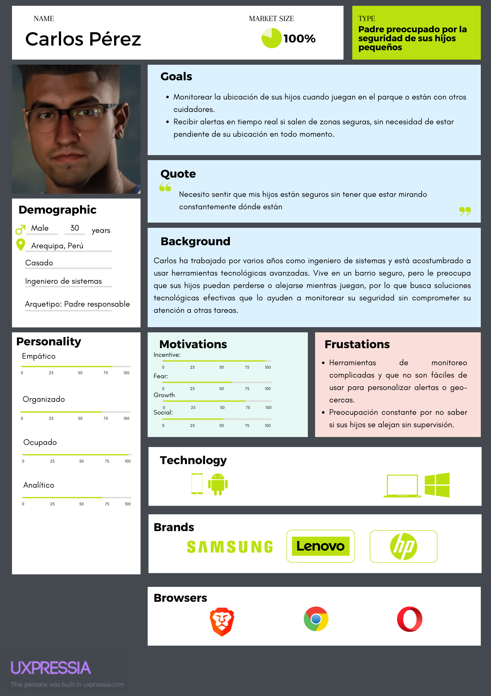
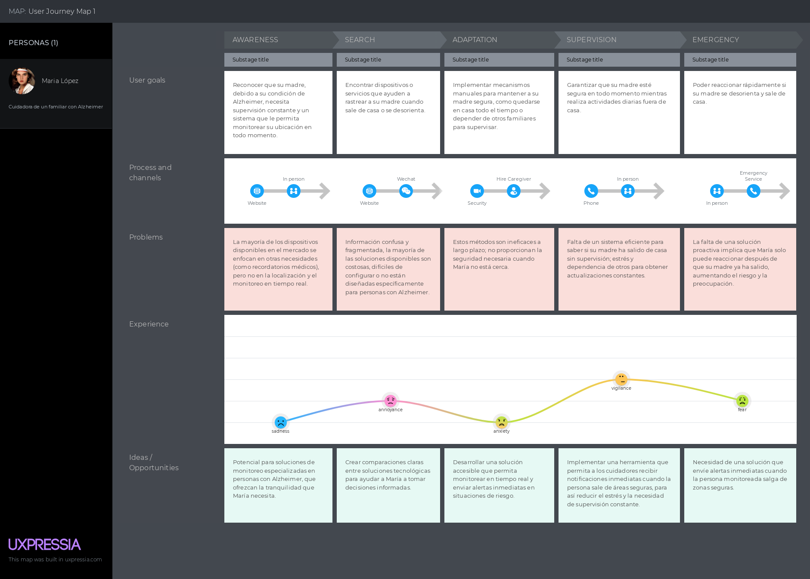
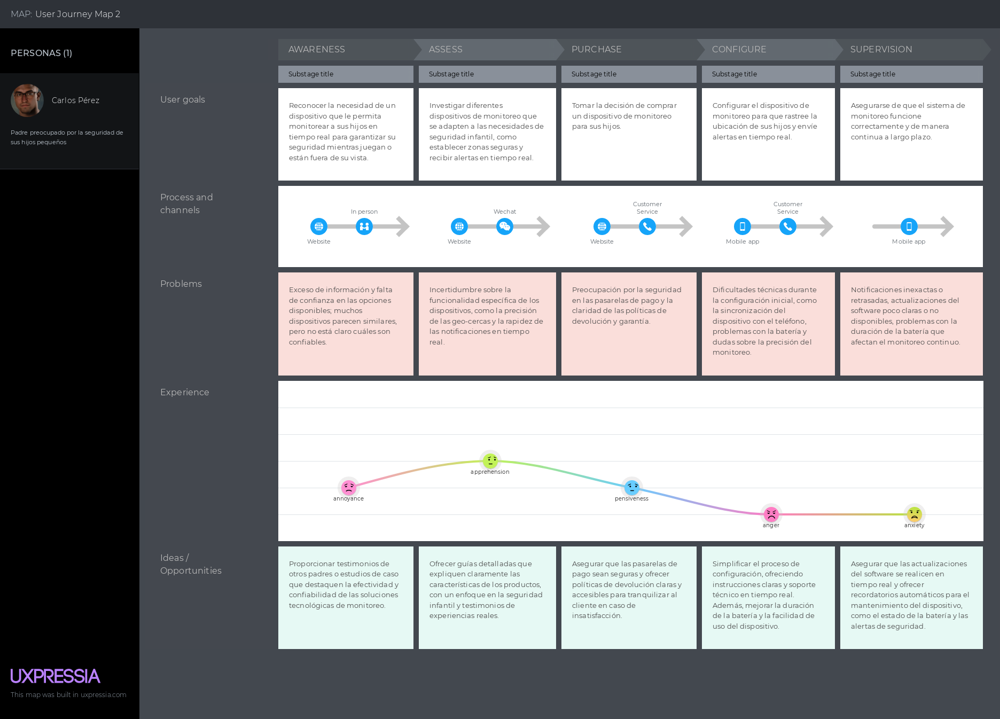
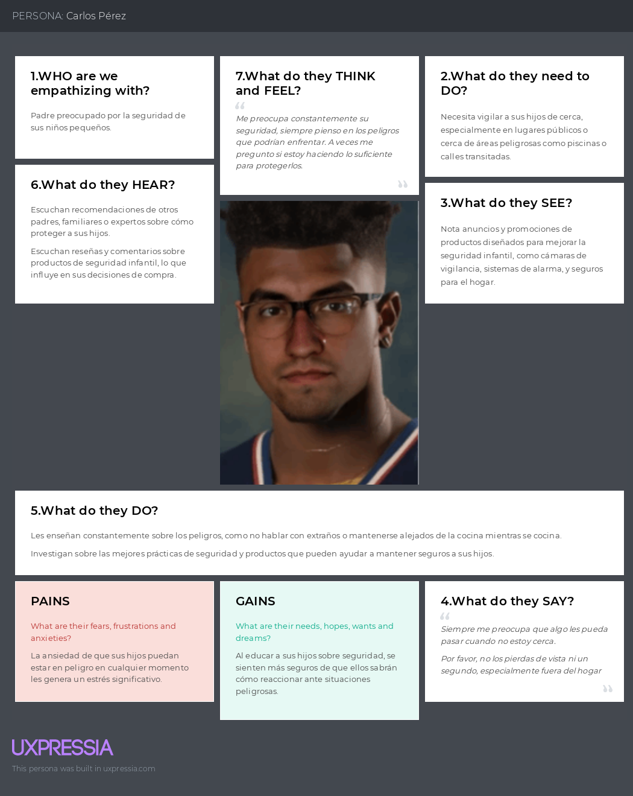
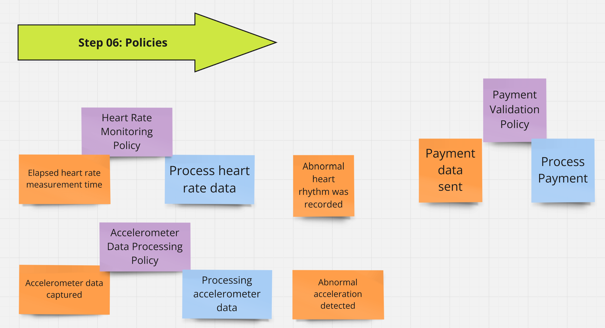
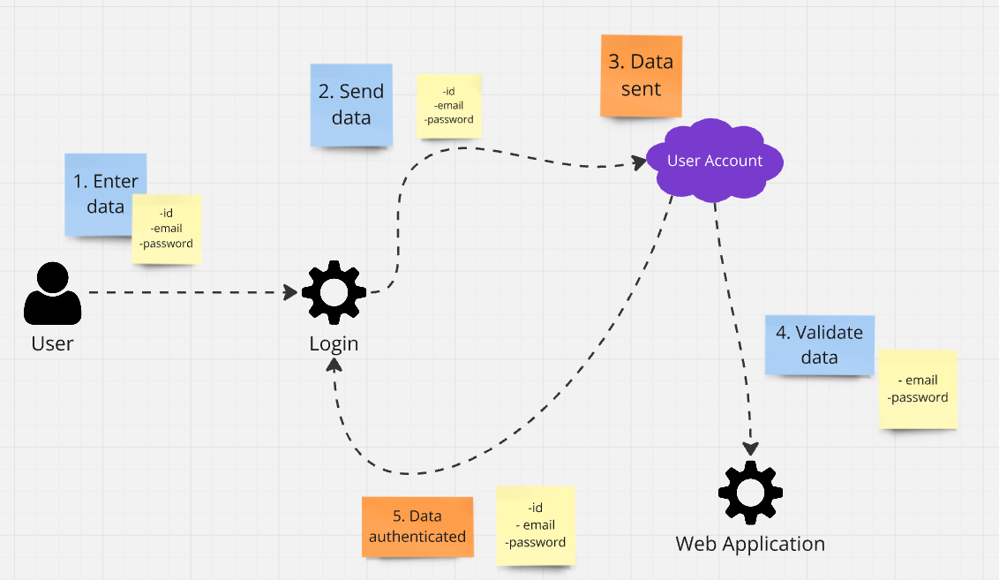
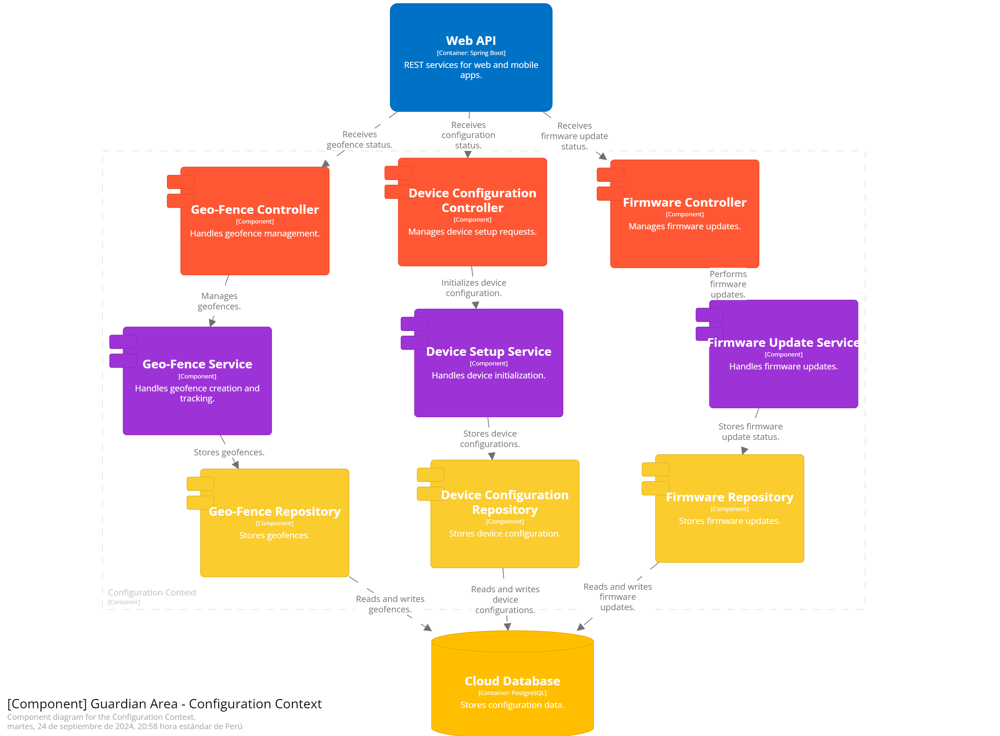
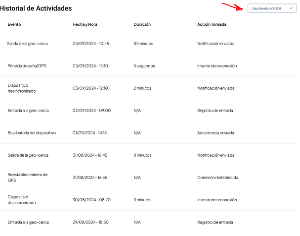
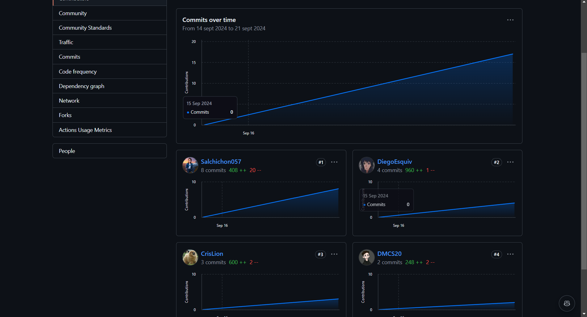

# <center>COURSE PROJECT</center>

<p align="center">
    <strong>Universidad Peruana de Ciencias Aplicadas</strong><br>
    </img><br>
    <strong>Ingeniería de Software - 7mo Ciclo</strong><br>
    <strong>Desarrollo de Soluciones IOT</strong><br>
    <strong>SW74</strong><br>
    <strong>Profesor: Angel Augusto Velasquez Nuñez</strong><br>
    <br><strong>INFORME TB1 </strong><br>
    <br><strong>Digital Dart</strong><br>
    <strong>GuardianArea</strong>
</p>

<div style="text-align:center;">
    <h3>Team Members:</h3>
    <table align="center">
        <tr>
            <th style="text-align:center;">Member</th>
            <th style="text-align:center;">Code</th>
        </tr>
        <tr>
            <td>Castillo Robles, Steve Roger</td>
            <td>U202121679</td>
        </tr>
        <tr>
            <td>Castro Soto, Diego Mauricio</td>
            <td>U202216636</td>
        </tr>
        <tr>
            <td>Espinoza Quispe, Jennifer Mary</td>
            <td>U202120911</td>
        </tr>
        <tr>
            <td>Esquivel Aguayo, Diego Martin</td>
            <td>U202116749</td>
        </tr>
        <tr>
            <td>Quito Igreda, Cristian Andrés</td>
            <td>U202121882</td>
        </tr>
    </table>
</div>

# Registro de Versiones del Informe

<table>
    <tr>
        <th>Versión</th>
        <th>Fecha</th>
        <th>Autor</th>
        <th>Descripción de modificación</th>
    </tr>
    <tr>
        <td rowspan="25">TB1</td>
        <td rowspan="5">Mes/Año</td>
        <td>Steve Roger Castillo Robles</td>
        <td>Descripción de las modificaciones realizadas en esta versión.</td>
    </tr>
    <tr>
        <td>Diego Mauricio Castro Soto</td>
        <td>Descripción de las modificaciones realizadas en esta versión.</td>
    </tr>
    <tr>
        <td>Jennifer Mary Espinoza Quispe</td>
        <td>Descripción de las modificaciones realizadas en esta versión.</td>
    </tr>
    <tr>
        <td>Diego Martin Esquivel Aguayo</td>
        <td>Descripción de las modificaciones realizadas en esta versión.</td>
    </tr>
    <tr>
        <td>Cristian Andrés Quito Igreda</td>
        <td>Descripción de las modificaciones realizadas en esta versión.</td>
    </tr>
</table>
<br><br>

# Project Report Collaboration Insights

<br>

# Contenido

## Tabla de Contenidos

### [Registro de Versiones del Informe](#registro-de-versiones-del-informe)

### [Project Report Collaboration Insights](#project-report-collaboration-insights)

### [Contenido](#contenido)

### [Student Outcomes](#student-outcome)

### [Capítulo I: Introducción](#capítulo-i-introducción)

- [1.1. Startup Profile](#11-startup-profile)
  - [1.1.1. Descripción de la Startup](#111-descripción-de-la-startup)
  - [1.1.2. Perfiles de integrantes del equipo](#112-perfiles-de-integrantes-del-equipo)
- [1.2. Solution Profile](#12-solution-profile)
  - [1.2.1. Antecedentes y problemática](#121-antecedentes-y-problemática)
  - [1.2.2. Lean UX Process](#122-lean-ux-process)
    - [1.2.2.1. Lean UX Problem Statements](#1221-lean-ux-problem-statements)
    - [1.2.2.2. Lean UX Assumptions](#1222-lean-ux-assumptions)
    - [1.2.2.3. Lean UX Hypothesis Statements](#1223-lean-ux-hypothesis-statements)
    - [1.2.2.4. Lean UX Canvas](#1224-lean-ux-canvas)
- [1.3. Segmentos objetivo](#13-segmentos-objetivo)

### [Capítulo II: Requirements Elicitation & Analysis](#capc3adtulo-ii-requirements-elicitation--analysis-1)

- [2.1. Competidores](#21-competidores)
  - [2.1.1. Análisis competitivo](#211-análisis-competitivo)
  - [2.1.2. Estrategias y tácticas frente a competidores](#212-estrategias-y-tácticas-frente-a-competidores)
- [2.2. Entrevistas](#22-entrevistas)
  - [2.2.1. Diseño de entrevistas](#221-diseño-de-entrevistas)
  - [2.2.2. Registro de entrevistas](#222-registro-de-entrevistas)
  - [2.2.3. Análisis de entrevistas](#223-análisis-de-entrevistas)
- [2.3. Needfinding](#23-needfinding)
  - [2.3.1. User Personas](#231-user-personas)
  - [2.3.2. User Task Matrix](#232-user-task-matrix)
  - [2.3.3. User Journey Mapping](#233-user-journey-mapping)
  - [2.3.4. Empathy Mapping](#234-empathy-mapping)
  - [2.3.5. As-is Scenario Mapping](#235-as-is-scenario-mapping)
- [2.4. Ubiquitous Language](#24-ubiquitous-language)

### [Capítulo III: Requirements Specification](#capc3adtulo-iii-requirements-specification)

- [3.1. To-Be Scenario Mapping](#31-to-be-scenario-mapping)
- [3.2. User Stories](#32-user-stories)
- [3.3. Impact Mapping](#33-impact-mapping)
- [3.4. Product Backlog](#34-product-backlog)

### [Capítulo IV: Solution Software Design](#capc3adtulo-iv-solution-software-design)

- [4.1. Strategic-Level Domain-Driven Design](#41-strategic-level-domain-driven-design)
  - [4.1.1. Event Storming](#411-event-storming)
    - [4.1.1.1 Candidate Context Discovery](#4111-candidate-context-discovery)
    - [4.1.1.2 Domain Message Flows Modeling](#4112-domain-message-flows-modeling)
    - [4.1.1.3 Bounded Context Canvases](#4113-bounded-context-canvases)
  - [4.1.2. Context Mapping](#412-context-mapping)
  - [4.1.3. Software Architecture](#413-software-architecture)
    - [4.1.3.1. Software Architecture System Landscape Diagram](#4131-software-architecture-system-landscape-diagram)
    - [4.1.3.2. Software Architecture Context Level Diagrams](#4132-software-architecture-context-level-diagrams)
    - [4.1.3.3. Software Architecture Deployment Diagrams](#4133-software-architecture-deployment-diagrams)
- [4.2. Tactical-Level Domain-Driven Design](#42-tactical-level-domain-driven-design)
  - [4.2.X. Bounded Context: Bounded Context Name](#42x-bounded-context-bounded-context-name)
    - [4.2.X.1. Domain Layer](#42x1-domain-layer)
    - [4.2.X.2. Interface Layer](#42x2-interface-layer)
    - [4.2.X.3. Application Layer](#42x3-application-layer)
    - [4.2.X.4. Infrastructure Layer](#42x4-infrastructure-layer)
    - [4.2.X.6. Bounded Context Software Architecture Component Level Diagrams](#42x6-bounded-context-software-architecture-component-level-diagrams)
    - [4.2.X.7. Bounded Context Software Architecture Code Level Diagrams](#42x7-bounded-context-software-architecture-code-level-diagrams)
      - [4.2.X.7.1. Bounded Context Domain Layer Class Diagrams](#42x71-bounded-context-domain-layer-class-diagrams)
      - [4.2.X.7.2. Bounded Context Database Design Diagram](#42x72-bounded-context-database-design-diagram)

### [Capítulo V: Solution UI/UX Design](#capc3adtulo-v-solution-uiux-design)
- [5.1. Style Guidelines](#51-style-guidelines)
  - [5.1.1. General Style Guidelines](#511-general-style-guidelines)
  - [5.1.2. Web, Mobile and IoT Style Guidelines](#512-web-mobile-and-iot-style-guidelines)
- [5.2. Information Architecture](#52-information-architecture)
  - [5.2.1. Organization Systems](#521-organization-systems)
  - [5.2.2. Labeling Systems](#522-labeling-systems)
  - [5.2.3. SEO Tags and Meta Tags](#523-seo-tags-and-meta-tags)
  - [5.2.4. Searching Systems](#524-searching-systems)
  - [5.2.5. Navigation Systems](#525-navigation-systems)
- [5.3. Landing Page UI Design](#53-landing-page-ui-design)
  - [5.3.1. Landing Page Wireframe](#531-landing-page-wireframe)
  - [5.3.2. Landing Page Mock-up](#532-landing-page-mock-up)
- [5.4. Applications UX/UI Design](#54-applications-uxui-design)
  - [5.4.1. Applications Wireframes](#541-applications-wireframes)
  - [5.4.2. Applications Wireflow Diagrams](#542-applications-wireflow-diagrams)
  - [5.4.3. Applications Mock-ups](#543-applications-mock-ups)
  - [5.4.4. Applications User Flow Diagrams](#544-applications-user-flow-diagrams)
- [5.5. Applications Prototyping](#55-applications-prototyping)

### [Capítulo VI: Product Implementation, Validation & Deployment](#capitulo-vi-product-implementation-validation-deployment)
- [6.1. Software Configuration Management](#61-software-configuration-management)
  - [6.1.1. Software Development Environment Configuration](#611-software-development-environment-configuration)
  - [6.1.2. Source Code Management](#612-source-code-management)
  - [6.1.3. Source Code Style Guide & Conventions](#613-source-code-style-guide-conventions)
  - [6.1.4. Software Deployment Configuration](#614-software-deployment-configuration)
- [6.2. Landing Page, Services & Applications Implementation](#62-landing-page-services-applications-implementation)

### [Conclusiones](#conclusiones)

- [Conclusiones y recomendaciones](#conclusiones-y-recomendaciones)

### [Bibliografía](#bibliografía)

### [Anexos](#anexos)

# Student Outcome

El curso contribuye al cumplimiento del Student Outcome ABET:
**ABET – EAC - Student Outcome 5**
**Criterio:** La capacidad de funcionar efectivamente en un equipo cuyos miembros
juntos proporcionan liderazgo, crean un entorno de colaboración e inclusivo,
establecen objetivos, planifican tareas y cumplen objetivos.
En el siguiente cuadro se describe las acciones realizadas y enunciados de
conclusiones por parte del grupo, que permiten sustentar el haber alcanzado el logro del ABET – EAC - Student Outcome 5.

<!-- Cambiamos el rowspan="1" por rowspan="n" cuando agregamos más de una acción realizada por criterio específico. (TB1, TP1, TB2, TF1)-->

<table>
    <tr>
        <th><b>Criterio específico</b></th>
        <th><b>Acciones realizadas</b></th>
        <th><b>Conclusiones</b></th>
    </tr>
    <tr>
        <td rowspan="1"><b>
            Trabaja en equipo para proporcionar liderazgo en forma conjunta </b></td>
        <td>TB1<br><br>
            <b>Steve Roger Castillo Robles</b><br>
            - Desarrolló las user personas, user task matrix, y el ubiquitous language. Lideró la creación del product backlog y colaboró en el canvas y las technical stories.
            <br><br> 
            <b>Diego Mauricio Castro Soto</b><br>
            - Realizó el to-be scenario mapping y contribuyó con user stories, bounded context canvases, bounded context y la arquitectura de software.
            <br><br>
            <b>Jennifer Mary Espinoza Quispe</b><br>
            - Lideró el análisis competitivo y el impact mapping. Participó en la creación de user stories, event storming y la arquitectura de software.
            <br><br>
            <b>Diego Martin Esquivel Aguayo</b><br>
            - Responsable del capítulo 1, introducción y descripción de la startup, lean UX process y segmentos objetivos. Colaboró en entrevistas, needfinding, event storming y bounded contexts.
            <br><br>
            <b>Cristian Andrés Quito Igreda</b><br>
            - Realizó el empathy mapping, as-is scenario mapping y context mapping. Contribuyó en los bounded contexts, diagramas de clases y diseño de la base de datos.
            <br><br>
        </td>
        <td>TB1<br><br>
            - El equipo trabajó de manera cohesionada para liderar diversas áreas clave del proyecto. Cada miembro asumió un rol de liderazgo en tareas específicas, lo que permitió una distribución efectiva del trabajo y el logro de los objetivos del proyecto.
        </td>
    </tr>
    <tr>
        <td rowspan="1"><b>
            Crea un entorno colaborativo e inclusivo, establece metas, planifica tareas y cumple objetivos.</b></td>
        <td>TB1<br><br>
            <b>Steve Roger Castillo Robles</b><br>
            - Contribuyó significativamente en la planificación de tareas mediante la creación de las user personas, la matriz de tareas y el backlog de producto, asegurando una buena organización de las actividades del equipo.
            <br><br> 
            <b>Diego Mauricio Castro Soto</b><br>
            - Estableció metas claras en el to-be scenario mapping y colaboró en la planificación de los bounded contexts, contribuyendo a la definición clara de roles y responsabilidades dentro del equipo.
            <br><br>
            <b>Jennifer Mary Espinoza Quispe</b><br>
            - Aportó en el impact mapping y análisis competitivo, fomentando un entorno inclusivo al integrar diversas perspectivas para mejorar la estrategia del proyecto.
            <br><br>
            <b>Diego Martin Esquivel Aguayo</b><br>
            - Organizó el capítulo introductorio y colaboró en las entrevistas y el event storming, garantizando que el equipo mantuviera sus metas en línea con los objetivos de la startup.
            <br><br>
            <b>Cristian Andrés Quito Igreda</b><br>
            - Facilitó la planificación del contexto y los diagramas de clase, asegurando que el equipo tuviera una estructura clara para la toma de decisiones técnicas.
            <br><br>
        </td>
        <td>TB1<br><br>
            - El equipo creó un entorno colaborativo en el que se fijaron metas claras y se asignaron tareas de manera equitativa. La planificación permitió cumplir los objetivos dentro del tiempo previsto y con alta calidad.
        </td>
    </tr>
</table>


# Capítulo I: Introducción

## 1.1. StartUp Profile

### 1.1.1. Descripción de la StartUp

**DigitalDart** es una empresa emergente de tecnología especializada en desarrollar soluciones IoT innovadoras para la seguridad y protección familiar. Nos enfocamos en crear dispositivos inteligentes que faciliten la monitorización y seguridad de personas vulnerables, como personas mayores con Alzheimer y niños pequeños. Nuestra misión es mejorar la seguridad familiar mediante herramientas tecnológicas avanzadas que ofrezcan monitoreo en tiempo real y alertas de seguridad.

### 1.1.2. Perfiles de integrantes del equipo

<table align="center"  border="1" width="70%" style="text-align:center;">
    <tr align="center">
        <td rowspan="3">
            
        </td>
        <td align="left">
            <b>Nombre y Apellido:</b>
            <br>            
            Steve Roger Castillo Robles
        </td>
    </tr>
    <tr>
        <td align="left">
        <b>Carrera:</b>
        <br>
        Ing. de Software
        </td>
    </tr>
    <tr>
        <td align="left">
        <b>Acerca de:</b>
        <br>
        Soy Steve Roger Castillo Robles, estudiante de Ingeniería de Software con una pasión por las nuevas tecnologías. Tengo habilidades en Angular, Vue, Spring Boot, bases de datos como Mysql, PostgreSQL. Además, utilizo Git y GitHub para la gestión eficiente de mis proyectos de manera eficiente. Siempre estoy buscando oportunidades para aplicar y expandir mis conocimientos en proyectos reales. Mi objetivo es utilizar mis habilidades y educación para contribuir de manera significativa en el campo de la tecnología.
        </td>
    </tr>
    <tr align="center">
        <td rowspan="3">
            
        </td>
        <td align="left">
            <b>Nombre y Apellido:</b>
            <br>            
            Diego Mauricio Castro Soto
        </td>
    </tr>
    <tr>
        <td align="left">
        <b>Carrera:</b>
        <br>
        Ing. de Software
        </td>
    </tr>
    <tr>
        <td align="left">
        <b>Acerca de:</b>
        <br>
        Soy Diego Castro, me considero alguien autodidacta a quién le gusta siempre aprender nuevas cosas leyendo diversos recursos en la web, ya sea investigando en foros, leyendo libros o a través de videos. Desde ya hace un tiempo me encuentro adquiriendo nuevos conocimientos de diversos lenguajes de programación como C, C++ y C#. Adicional a esto me encuentro sumamente interesado en ahondar en las ramas del desarrollo de videojuegos, la seguridad informática y el desarrollo de aplicaciones web.
        </td>
    </tr>
    <tr align="center">
        <td rowspan="3">
            
        </td>
        <td align="left">
            <b>Nombre y Apellido:</b>
            <br>            
            Jennifer Mary Espinoza Quispe
        </td>
    </tr>
    <tr>
        <td align="left">
        <b>Carrera:</b>
        <br>
        Ing. de Software
        </td>
    </tr>
    <tr>
        <td align="left">
        <b>Acerca de:</b>
        <br>
        Soy Jennifer Espinoza, me encuentro en el 7mo ciclo de la carrera de Ing. de Software. En lo personal, me agrada aprender cosas nuevas, como nuevos lenguajes de programación e idiomas. Actualmente manejo el lenguaje de C++, un poco de Python y TypeScript. A nivel de desarrollo web conozco frameworks como Angular y Sprint Boot. Me considero una persona creativa, responsable y paciente, habilidades que ayudarán en el presente proyecto.
        </td>
    </tr>
    <tr align="center">
        <td rowspan="3">
            
        </td>
        <td align="left">
            <b>Nombre y Apellido:</b>
            <br>            
            Diego Martin Esquivel Aguayo
        </td>
    </tr>
    <tr>
        <td align="left">
        <b>Carrera:</b>
        <br>
        Ing. de Software
        </td>
    </tr>
    <tr>
        <td align="left">
        <b>Acerca de:</b>
        <br>
        Soy Diego Esquivel, tengo 20 años, me encuentro en el séptimo ciclo de Ingeniería de Software. Soy una persona amigable, tranquila, responsable y ordenada. Cumplo con entregar los trabajos en los plazos establecidos y me adapto fácilmente a las condiciones del trabajo en equipo y a los nuevos lenguajes de programación. 
        </td>
    </tr>
    <tr align="center">
        <td rowspan="3">
            
        </td>
        <td align="left">
            <b>Nombre y Apellido:</b>
            <br>            
            Cristian Andrés Quito Igreda
        </td>
    </tr>
    <tr>
        <td align="left">
        <b>Carrera:</b>
        <br>
        Ing. de Software
        </td>
    </tr>
    <tr>
        <td align="left">
        <b>Acerca de:</b>
        <br>
        Soy Cristian Andrés Quito Igreda y estoy estudiando la carrera de Ingeniería de Software en la UPC. La razón principal por la que escogí esta carrera es porque desde mis inicios de la secundaria me causó curiosidad el funcionamiento interno de las aplicaciones de escritorio y web como también el desarrollo de grandes proyectos de software. Entre mis principales habilidades destaca la responsabilidad, el trabajo en equipo y el pensamiento lógico para la resolución de problemas. Finalmente, poseo conocimientos intermedios en C++, Python y SQL Server, además de contar con experiencia en Git, GitHub, PostgreSQL y MongoDB.
        </td>
    </tr>
</table>

## 1.2. Solution Profile

## 1.2.1. Antecedentes y problemática

El cuidado de personas vulnerables, como los mayores con Alzheimer y los niños pequeños, presenta desafíos importantes en cuanto a su seguridad. Estos grupos son especialmente susceptibles a situaciones peligrosas si no se monitorean adecuadamente. La falta de soluciones tecnológicas accesibles y efectivas puede poner en riesgo su bienestar, lo que genera preocupación en sus cuidadores y familiares.

Según el Informe Mundial sobre el Alzheimer 2023, aproximadamente el 60% de las personas que padecen Alzheimer deambulan al menos una vez, lo que puede resultar en situaciones peligrosas si no se detectan a tiempo. De manera similar, los niños pequeños, al ser curiosos por naturaleza, pueden fácilmente salir de áreas seguras, lo que requiere una supervisión constante y efectiva.

**GuardianArea** es una solución diseñada para enfrentar estos desafíos, ofreciendo una pulsera con rastreador que permite establecer geo-cercas y recibir notificaciones en tiempo real si la persona monitoreada o el niño salen de las zonas seguras, asegurando su protección y brindando tranquilidad a los cuidadores y familiares.


### What (¿Qué?)

El principal problema identificado es la dificultad de monitorear a personas vulnerables, como los mayores con Alzheimer y los niños pequeños, lo que puede llevar a situaciones de riesgo si no se detectan a tiempo.

### When (¿Cuándo?)

El problema surge cuando estas personas salen de áreas seguras, lo que puede ocurrir en cualquier momento si no se supervisa adecuadamente.

### Where (¿Dónde?)

El problema se identifica en entornos familiares, centros de atención y espacios públicos, donde estas personas son más propensas a deambular sin supervisión.

### Who (¿Quién?)

Este problema afecta a los cuidadores y familiares de personas con Alzheimer y niños pequeños, quienes tienen la responsabilidad de garantizar su seguridad.

### Why (¿Por qué?)

La causa principal es la falta de herramientas de monitoreo en tiempo real que permitan detectar y alertar sobre la salida de las zonas seguras, lo que pone en riesgo la seguridad de estas personas.

### How (¿Cómo?)

La solución propuesta es **GuardianArea**, una pulsera con rastreador que permite establecer geo-cercas y recibir notificaciones en tiempo real si la persona monitoreada o el niño salen de las zonas seguras.

### How much (¿Cuánto?)

Este problema tiene un impacto significativo en la seguridad y bienestar de las personas vulnerables. El uso de **GuardianArea** podría reducir el riesgo de situaciones peligrosas en un 70% dentro de los primeros seis meses de implementación.

## 1.2.2. Lean UX Process

### 1.2.2.1. Lean UX Problem Statements

El cuidado de personas mayores con Alzheimer y niños pequeños presenta desafíos significativos para garantizar su seguridad debido a la falta de herramientas efectivas de monitoreo. Estas personas vulnerables están en riesgo de situaciones peligrosas, como el deambular o salir de áreas seguras sin ser detectados.

La ausencia de soluciones tecnológicas accesibles y efectivas exacerba estos riesgos, poniendo en peligro la vida y el bienestar de estos individuos.

¿Cómo podemos mejorar la seguridad de personas mayores con Alzheimer y niños pequeños mediante un sistema de monitoreo en tiempo real que alerte a sus cuidadores y familiares cuando se salen de las zonas seguras?

### 1.2.2.2. Lean UX Assumptions

**Features:**

- Monitoreo en tiempo real mediante geo-cercas.
- Alertas automáticas cuando la persona monitoreada sale de la zona segura.
- Acceso a un historial de movimientos para análisis y prevención.

**Business outcomes:**

- Incremento en la adopción del sistema por parte de familias y centros de cuidado.
- Generación de ingresos mediante la venta de pulseras y suscripciones a servicios de monitoreo.
- Expansión geográfica y diversificación en otros segmentos vulnerables.

**Users:**

- Cuidadores y familiares de personas mayores con Alzheimer.
- Cuidadores y familiares de niños pequeños.

**Users outcomes:**

- Mejora en la seguridad y bienestar de personas vulnerables.
- Reducción en los niveles de ansiedad y estrés en cuidadores y familiares. 
- Mayor tranquilidad al saber que pueden reaccionar rápidamente ante cualquier emergencia.

### 1.2.2.3. Lean UX Hypothesis Statements

**Hipótesis 1:** Creemos que, al proporcionar un sistema de monitoreo en tiempo real para personas vulnerables, mejoraremos su seguridad y bienestar. Sabremos que hemos tenido éxito cuando veamos una reducción del 70% en incidentes relacionados con la salida de zonas seguras dentro de los primeros seis meses de implementación.

**Hipótesis 2:** Creemos que al ofrecer alertas automáticas cuando la persona monitoreada sale de la zona segura, los cuidadores podrán reaccionar rápidamente para evitar situaciones peligrosas. Sabremos que hemos tenido éxito si el 95% de las alertas son atendidas en un plazo de 10 minutos, evitando cualquier riesgo significativo.

**Hipótesis 3:** Creemos que, al permitir el acceso al historial de movimientos, los cuidadores podrán prever posibles situaciones de riesgo. Sabremos que hemos tenido éxito si el 80% de los usuarios utiliza esta función para ajustar las zonas seguras dentro de los primeros tres meses.

**Hipótesis 4:** Creemos que al incorporar un sistema de geo-cercas personalizable en tiempo real, los cuidadores podrán adaptar rápidamente las áreas seguras. Sabremos que hemos tenido éxito cuando el 90% de los usuarios ajusten las zonas al menos una vez al mes.

**Hipótesis 5:** Creemos que, al integrar un sistema de notificaciones por voz, los cuidadores tendrán una respuesta más rápida. Sabremos que hemos tenido éxito si el 85% de los usuarios considera útil esta característica.

**Hipótesis 6:** Creemos que, al implementar un historial de alertas con recomendaciones automatizadas, los cuidadores podrán anticiparse a situaciones de riesgo. Sabremos que hemos tenido éxito si el 75% de los cuidadores encuentran las recomendaciones útiles para la prevención.

### 1.2.2.4. Lean UX Canvas

<div style="text-align: center;">
    
</div>

## 1.3. Segmentos objetivo

**Segmento objetivo 1: Cuidadores o Familiares de personas con Alzheimer**  
Este segmento se enfoca en los cuidadores y familiares de personas con Alzheimer que necesitan monitorear de cerca a estos pacientes para garantizar su seguridad. Buscan herramientas que les permitan reaccionar rápidamente ante situaciones peligrosas y mantener la tranquilidad de saber que sus seres queridos están seguros.

**Segmento objetivo 2: Cuidadores o Familiares de niños pequeños**  
Este segmento incluye a los cuidadores y familiares de niños pequeños que desean aumentar la seguridad y supervisión de los niños. Están interesados en soluciones que les permitan prevenir situaciones peligrosas al recibir alertas cuando los niños salen de las zonas seguras establecidas.

# Capítulo II: Requirements Elicitation & Analysis

## 2.1. Competidores

Luego de realizar una investigación en el mercado IOT, hemos hallado tres portales que ofrecen características similares a la de GuardianArea, por eso son considerados como potenciales competidores. Estos competidores son:

1. **Angel Sense**: Dispositivo de rastreo GPS diseñado específicamente para la seguridad de niños, personas con necesidades especiales y adultos mayores. Ofrece funcionalidades como alertas de geocercas, monitoreo en tiempo real y comunicación directa con el usuario a través de una aplicación móvil.

<div style="text-align: center;">
    
</div>

2. **Theora Care**: Proporciona soluciones de monitoreo dirigidas a personas mayores, especialmente aquellas con Alzheimer. Su plataforma incluye sensores de actividad, rastreo GPS y herramientas para detectar comportamientos inusuales.
 
<div style="text-align: center;">
    
</div>

3. **Revolutionary Tracker**: Dispositivo portátil que combina el rastreo GPS con sensores de salud y seguridad. Su enfoque principal está en ofrecer un monitoreo integral para personas mayores, ayudando a las familias a mantener a sus seres queridos seguros y monitoreados.

<div style="text-align: center;">
    
</div>

### 2.1.1. Análisis competitivo

<table>
  <tr>
    <th colspan="7" valign="top"><b>Competitive Analysis Landscape</b></th>
  </tr>
  <tr>
    <td colspan="2" rowspan="2">¿Por qué llevar a cabo este análisis?</td>
    <td colspan="5">Escriba en el recuadro la pregunta que busca responder o el objetivo de este análisis.</td>
  </tr>
  <tr>
    <td colspan="5">Este análisis se realizó con la finalidad de poder identificar a nuestros potenciales competidores e idear estrategias y tácticas para diferenciarnos de estos.</td>
  </tr>
  <tr>
    <td colspan="3">(En la cabecera colocar por cada competidor nombre y logo)</td>
    <td colspan="1" valign="top" style="font-weight: bold;">
        GuardianArea
        <br>
        <div style="text-align: center; margin-top: 10px;">
            
        </div>
    <td colspan="1" valign="top" style="font-weight: bold;">
    Theora Care
    <div style="text-align: center; margin-top: 10px">
      
    </div>
    <td colspan="1" valign="top" style="font-weight: bold;">
      AngelSense
      <div style="text-align: center;">
      
    </div>
    <td colspan="1" valign="top" style="font-weight: bold;" >
      Revolutionary Tracker 
      <div style="text-align: center; margin-top: 10px;">
        
            </div>
    </td>
  </tr>
  <tr>
    <td colspan="1" rowspan="2"><p>Perfil</p></td>
    <td colspan="2">Overview</td>
    <td colspan="1" valign="top">Solución avanzada de monitoreo GPS con sensores adicionales para niños y personas con Alzheimer.</td>
    <td colspan="1" valign="top">Sistema de monitoreo para personas mayores con Alzheimer, incluye sensores de actividad.</td>
    <td colspan="1" valign="top">Dispositivo de rastreo GPS enfocado en niños, personas con necesidades especiales y adultos mayores.</td>
    <td colspan="1" valign="top">Dispositivo portátil de rastreo GPS con sensores para detección de caídas y alertas.
    </td>
  </tr>
  <tr>
    <td colspan="2">Ventaja competitiva ¿Qué valor ofrece a los clientes?</td>
    <td colspan="1" valign="top">Monitoreo en tiempo real, detección de caídas, alertas personalizables, sensores de salud integrados y configuración de geocercas</td>
    <td colspan="1" valign="top">Monitoreo constante de actividad diaria y detección de patrones de comportamiento para evitar caídas y futuras lesiones.</td>
    <td colspan="1" valign="top">Enfoque específico en la seguridad infantil con alertas de geocercas.</td>
    <td colspan="1" valign="top">Combinación de rastreo GPS con monitoreo de salud y seguridad.</td>
  </tr>
  <tr>
    <td colspan="1" rowspan="2"><p>Perfil de Marketing</p></td>
    <td colspan="2">Mercado objetivo</td>
    <td colspan="1" valign="top">Familia con niños y familia con personas con Alzheimer</td>
    <td colspan="1" valign="top">Cuidadores y familias de personas con Alzheimer.</td>
    <td colspan="1" valign="top">Padres de niños con necesidades especiales, escuelas.</td>
    <td colspan="1" valign="top">Familias y cuidadores de personas mayores.</td>
  </tr>
  <tr>
    <td colspan="2">Estrategias de marketing</td>
    <td colspan="1" valign="top">GuardianArea planteará una estrategia basada en publicidad en redes sociales, colaboraciones con centros de salud, comunidades médicas y de cuidado con un enfoque en tranquilidad familiar.</td>
    <td colspan="1" valign="top">Campañas en comunidades médicas y asociaciones de Alzheimer.</td>
    <td colspan="1" valign="top">Enfoque en redes sociales y grupos de apoyo para niños con necesidades especiales.</td>
    <td colspan="1" valign="top">Publicidad en revistas de salud y bienestar, marketing digital enfocado en seguridad.</td>
  </tr>
  <tr>
    <td colspan="1" rowspan="3"><p>Perfil de Producto</p></td>
    <td colspan="2">Productos & Servicios</td>
    <td colspan="1" valign="top">Dispositivo portátil con GPS y sensores para monitoreo de salud y seguridad. Además, plataforma digital para el monitoreo a través de un dashboard y control de sensores y configuración de geocercas.</td>
    <td colspan="1" valign="top">Monitoreo de actividad, rastreo GPS, alertas de comportamiento inusual.</td>
    <td colspan="1" valign="top">Dispositivo de rastreo GPS con alertas.</td>
    <td colspan="1" valign="top">Dispositivo portátil con GPS, sensores de caída, y monitoreo de salud.</td>
  </tr>
  <tr>
    <td colspan="2">Precios & Costos</td>
    <td colspan="1" valign="top">$150 por dispositivo, suscripción mensual entre $10 a $35</td>
    <td colspan="1" valign="top">$247.97 por dispositivo con un plan mensual de $29.97</td>
    <td colspan="1" valign="top">$229 por el dispositivo con un plan mensual de $49.99 mensuales por un plan anual. Con una tarifa de activación de $19.</td>
    <td colspan="1" valign="top">262.87 por el dispositivo</td>
  </tr>
  <tr>
    <td colspan="2">Canales de distribución (Web y/o Móvil)</td>
    <td colspan="1" valign="top">Los canales de distribución son Página web oficial, App Store y Google Play.</td>
    <td colspan="1" valign="top">Los canales de distribución son Página web oficial, App Store y Google Play.</td>
    <td colspan="1" valign="top">Los canales de distribución son Página web oficial, App Store y Google Play.</td>
    <td colspan="1" valign="top">El canal de distribución es la Web</td>
  </tr>
  <tr>
    <td colspan="1" rowspan="5"><p>Análisis SWOT</p></td>
    <td colspan="6">Realice esto para su startup y sus competidores. Sus fortalezas deberían apoyar sus oportunidades y contribuir a lo que ustedes definen como su posible ventaja competitiva.</td>
  </tr>
  <tr>
    <td colspan="2">Fortalezas</td>
    <td colspan="1" valign="top">Integración de sensores de salud y seguridad, fácil de usar, enfoque en segmentos vulnerables y genración de dashboard de indicadores.</td>
    <td colspan="1" valign="top">Comunicación directa con el usuario, accesible y fácil de usar para personas mayores.</td>
    <td colspan="1" valign="top">Diseño especializado para niños, alertas rápidas, fácil uso para padres.</td>
    <td colspan="1" valign="top">Combinación de tecnologías de seguridad y salud en un solo dispositivo.</td>
  </tr>
  <tr>
    <td colspan="2">Debilidades</td>
    <td colspan="1" valign="top">Necesidad de suscripción mensual.</td>
    <td colspan="1" valign="top">Precio elevado y enfoque limitado a personas con Alzheimer.</td>
    <td colspan="1" valign="top">Costo mensual elevado, limitado a un solo usuario por dispositivo.</td>
    <td colspan="1" valign="top">Enfoque principal en personas mayores y sin actualizaciones constantes en sus redes.</td>
  </tr>
  <tr>
    <td colspan="2">Oportunidades</td>
    <td colspan="1" valign="top">Expansión hacia otros mercados de salud y bienestar, integración con apps de salud.</td>
    <td colspan="1" valign="top">Expansión de las funciones para otros tipos de enfermedades neurodegenerativas.</td>
    <td colspan="1" valign="top">Expansión a mercados internacionales, mejoras en la precisión del rastreo.</td>
    <td colspan="1" valign="top">Ampliación de la funcionalidad para incluir más métricas de salud.</td>
  </tr>
  <tr>
    <td colspan="2">Amenazas</td>
    <td colspan="1" valign="top">Competencia de dispositivos con integración de IA</td>
    <td colspan="1" valign="top">Nuevas soluciones de monitoreo basadas en IA que podrían ofrecer mejores resultados.	</td>
    <td colspan="1" valign="top">Aparición de nuevos competidores con tecnología más avanzada.</td>
    <td colspan="1" valign="top">Competencia en un mercado saturado de dispositivos de rastreo y monitoreo.</td>
  </tr>
</table>

### 2.1.2. Estrategias y tácticas frente a competidores

GuardianArea implementará estrategias específicas para destacar en el mercado, nos basaremos en nuestras fortalezas y oportunidades y abordaremos las áreas de mejora necesarias:

1. **Interfaz Mejorada y Usabilidad**: Simplificaremos el diseño de la interfaz para que sea fácil de navegar, permitiendo que los usuarios configuren geocercas y reciban alertas sin complicaciones. La facilidad de uso será un diferenciador clave.

2. **Optimización del Usuario**: Usaremos datos de sensores para presentar gráficos claros en el dashboard, lo que permitirá a los usuarios interpretar rápidamente la información relevante.

3. **Retroalimentación para Mejora Continua**: Recogeremos opiniones de los usuarios y ajustaremos la plataforma según sus necesidades, asegurando que las funcionalidades evolucionen de acuerdo con sus expectativas.

4. **Marketing Específico y Alianzas Estratégicas**:Ejecutaremos campañas digitales enfocadas en familias y cuidadores, usando redes sociales y grupos especializados. Además, estableceremos alianzas con instituciones de salud para aumentar nuestra presencia en el mercado.

## 2.2. Entrevistas
Esta sección se enfoca en la investigación, utilizando los datos recopilados a través de las entrevistas con representantes de los segmentos objetivo como punto de partida.


### 2.2.1 Diseño de entrevistas

**Preguntas Demográficas**

- ¿Cómo te llamas?
- ¿Cuántos años tienes?
- ¿Lugar de residencia?
- Estado Civil?
- ¿A qué te dedicas actualmente?
- ¿Qué smartphone posee? ¿Android o IOS?
- ¿Cuál es su motor de búsqueda favorito?
- ¿Cuales son sus marcas favoritas en general?
- ¿Cuales son las redes sociales que más utiliza?
**Preguntas sobre personalidad:**

- ¿Te consideras una persona extrovertida o introvertida? ¿Por qué?

---

### Entrevistas para Cuidadores o Familiares de Personas con Alzheimer

**Datos Demográficos**

1. ¿Cuál es su relación con la persona que padece Alzheimer?

**Preferencias y Uso de Tecnología**

1. ¿Con qué frecuencia utiliza estas tecnologías (aplicaciones móviles y aplicaciones web)?
2. ¿Utiliza actualmente algún dispositivo o tecnología para monitorear la salud o ubicación de su ser querido?
3. ¿Ha habido alguna situación en la que sintió que una tecnología podría haberle ayudado, pero no la tenía a su disposición?

**Objetivos y Motivaciones**

1. ¿Cuáles son sus principales preocupaciones en el cuidado de su ser querido con Alzheimer?
2. ¿Qué espera obtener de un sistema que monitoree en tiempo real la ubicación y salud de su ser querido?
3. ¿Le gustaría tener la posibilidad de compartir los datos del monitoreo con otros miembros de la familia o cuidadores?

**Frustraciones y Desafíos**

1. ¿Cuáles son las mayores dificultades que enfrenta en el cuidado diario de su ser querido?
2. ¿Ha enfrentado algún problema que podría haber sido resuelto con tecnología?

**Biografía**

1. ¿Cuánto tiempo lleva cuidando a su ser querido con Alzheimer?
2. ¿Cómo describiría un día típico en el cuidado de su ser querido?

**Opinión sobre la idea de negocio**

1. ¿Qué te parece la idea de nuestro proyecto? ¿Te sería útil?
2. ¿Tienes sugerencias sobre posibles mejoras o características adicionales que podríamos integrar en nuestra aplicación?

---

### Entrevistas para Cuidadores o Familiares de Niños Pequeños

**Datos Demográficos**

1. ¿Cuál es su relación con el niño que cuida?

**Preferencias y Uso de Tecnología**

1. ¿Con qué frecuencia utiliza dispositivos tecnológicos (smartphones, tablets, wearables)?
2. ¿Qué tan cómodo se siente utilizando aplicaciones móviles?
3. ¿Utiliza actualmente algún dispositivo o tecnología para monitorear la seguridad o salud de su hijo/a?
4. ¿Ha habido alguna situación en la que sintió que una tecnología podría haberle ayudado, pero no la tenía a su disposición?

**Objetivos y Motivaciones**

1. ¿Cuáles son sus principales preocupaciones en relación a la seguridad y bienestar de su hijo/a?
2. ¿Qué beneficios espera obtener de un sistema que monitoree en tiempo real la ubicación y salud de su hijo/a?
3. ¿Qué características considera más importantes en un sistema de monitoreo? (e.g., alertas, seguimiento de ubicación, monitoreo de salud, facilidad de uso, etc.)
4. ¿Le gustaría tener la posibilidad de compartir los datos del monitoreo con otros miembros de la familia o cuidadores?

**Frustraciones y Desafíos**

1. ¿Qué problemas has enfrentado en el cuidado diario de su hijo/a?
2. ¿Ha enfrentado algún problema que podría haber sido resuelto con tecnología?

**Biografía**

1. ¿Cuánto tiempo lleva cuidando a su hijo/a?
2. ¿Cómo describiría un día típico en el cuidado de su hijo/a?

**Opinión sobre la idea de negocio**

1. ¿Qué te parece la idea de nuestro proyecto? ¿Te sería útil?
2. ¿Tienes sugerencias sobre posibles mejoras o características adicionales que podríamos integrar en nuestra aplicación?

### 2.2.2 Registro de entrevistas

### Segmento 1: Cuidadores o Familiares de personas con Alzheimer

**Entrevista 01**
- Nombres: Aldo Alberto
- Apellidos: Baldeón Fabian
- Edad: 21
- Distrito: Villa María del Triunfo 
- Evidencia de la reunión: 
    <div align=center>
        
    </div> 
- Inicio: 5:02
- Fin: 9:43
- Enlace de entrevista: https://upcedupe-my.sharepoint.com/:v:/g/personal/u202116749_upc_edu_pe/EbNi22cIs6xAuxvyhGVKZ3oBwrIO8owUbi7ou5sCDa-2GA?e=0g4e0m&nav=eyJyZWZlcnJhbEluZm8iOnsicmVmZXJyYWxBcHAiOiJTdHJlYW1XZWJBcHAiLCJyZWZlcnJhbFZpZXciOiJTaGFyZURpYWxvZy1MaW5rIiwicmVmZXJyYWxBcHBQbGF0Zm9ybSI6IldlYiIsInJlZmVycmFsTW9kZSI6InZpZXcifSwicGxheWJhY2tPcHRpb25zIjp7InN0YXJ0VGltZUluU2Vjb25kcyI6MzAyLjU1fX0%3D
   
- Resumen de la entrevista: 

    Aldo Baldeón es estudiante en la UPC y se identifica como una persona introvertida. Comenta que pasa la mayor parte de su tiempo en casa estudiando y no suele salir con frecuencia. Aldo está a cargo del cuidado de su abuelo, quien padece de Alzheimer, y aunque no utiliza tecnologías avanzadas para monitorearlo, recurre a aplicaciones básicas como WhatsApp para sus estudios y comunicación.

    Aldo expresó sus principales preocupaciones respecto al bienestar de su abuelo, que incluyen la confusión, desorientación y el riesgo de que se escape de casa, además de la necesidad constante de asistencia para sus necesidades básicas. Estos factores le generan mucho estrés en su día a día.

    Un sistema de monitoreo en tiempo real le resultaría muy útil, especialmente uno que pueda alertarlo si su abuelo sale de los límites de su hogar, facilitando su búsqueda en caso de que se pierda.

    Aldo comparte la responsabilidad del cuidado de su abuelo con una prima, turnándose los fines de semana y durante la semana. Entre sus tareas diarias destacan alimentarlo, bañarlo y mantenerlo entretenido mediante la conversación.

    Finalmente, Cristian presentó la idea de Biocercos, un proyecto de sistema de monitoreo que podría definir áreas específicas y emitir alertas sobre la ubicación y estado de salud del paciente. Aldo consideró que este proyecto sería de gran utilidad, destacando que la capacidad de recibir alertas sobre la ubicación de su abuelo sería una característica esencial.

**Entrevista 02**
- Nombres: Adrián Martín
- Apellidos: Quito Igreda
- Edad: 20
- Distrito: Los Olivos
- Evidencia de la reunión:
    <div align=center>
        
    </div>  
- Inicio: 0:11
- Fin: 5:01
- Enlace de entrevista: https://upcedupe-my.sharepoint.com/:v:/g/personal/u202116749_upc_edu_pe/EbNi22cIs6xAuxvyhGVKZ3oBwrIO8owUbi7ou5sCDa-2GA?e=8xJ9D5&nav=eyJyZWZlcnJhbEluZm8iOnsicmVmZXJyYWxBcHAiOiJTdHJlYW1XZWJBcHAiLCJyZWZlcnJhbFZpZXciOiJTaGFyZURpYWxvZy1MaW5rIiwicmVmZXJyYWxBcHBQbGF0Zm9ybSI6IldlYiIsInJlZmVycmFsTW9kZSI6InZpZXcifSwicGxheWJhY2tPcHRpb25zIjp7InN0YXJ0VGltZUluU2Vjb25kcyI6MTEuOTR9fQ%3D%3D
- Resumen de la entrevista:

  Adrián Martín Quito es estudiante de Ingeniería Electrónica en la UPC y se describe como una persona introvertida. Vive en Los Olivos y está a cargo del cuidado de su abuela, quien padece de Alzheimer. Aunque utiliza aplicaciones móviles y web diariamente, Adrián no emplea dispositivos específicos para monitorear a su abuela, prefiriendo un enfoque más tradicional y constante en su cuidado.

  Entre sus principales preocupaciones se encuentran los riesgos cotidianos a los que su abuela podría estar expuesta, como abrir la puerta a extraños o olvidar apagar electrodomésticos. La posibilidad de volver a clases presenciales aumenta su preocupación por la seguridad de su abuela. Adrián cree que una aplicación que monitoree en tiempo real la ubicación y el estado de su abuela sería muy útil.

  En su rutina diaria, Adrián enfrenta desafíos como que su abuela a veces no lo reconoce o tiene dificultades para realizar tareas de manera independiente. Aunque esta situación ha afectado sus estudios, Adrián dedica más tiempo al cuidado de su abuela, priorizando su seguridad por encima de otras responsabilidades.

  Adrián ha estado en esta situación durante aproximadamente cuatro meses, desde que la condición de su abuela se agravó. Aunque lo encuentra desafiante, está dispuesto a adaptarse y explorar nuevas soluciones que puedan mejorar la calidad de vida de su abuela y reducir el estrés del cuidado.

  Finalmente, Adrián considera que un sistema de geo-cerca sería una solución ideal para monitorear a su abuela. Además, sugiere que la inclusión de una cámara que se active al recibir una alarma ayudaría a verificar si su abuela está en peligro, brindando una mayor sensación de seguridad y tranquilidad.

**Entrevista 03**
- Nombres: Piero Alessandro
- Apellidos: Descalzi Saenz
- Edad: 21
- Distrito: Breña
- Evidencia de la reunión:
   <div align=center>
        
    </div> 
- Inicio: 9:44
- Fin: 14:42
- Enlace de entrevista: https://upcedupe-my.sharepoint.com/:v:/g/personal/u202116749_upc_edu_pe/EbNi22cIs6xAuxvyhGVKZ3oBwrIO8owUbi7ou5sCDa-2GA?e=5Ahe9I&nav=eyJyZWZlcnJhbEluZm8iOnsicmVmZXJyYWxBcHAiOiJTdHJlYW1XZWJBcHAiLCJyZWZlcnJhbFZpZXciOiJTaGFyZURpYWxvZy1MaW5rIiwicmVmZXJyYWxBcHBQbGF0Zm9ybSI6IldlYiIsInJlZmVycmFsTW9kZSI6InZpZXcifSwicGxheWJhY2tPcHRpb25zIjp7InN0YXJ0VGltZUluU2Vjb25kcyI6NTg0LjUzfX0%3D
- Resumen de la entrevista: 

    Durante la entrevista, recibí a Piero Descalci, un diseñador de videojuegos de 21 años que vive en Lima, Breña, y que se describe como una persona introvertida. Piero me comentó que prefiere pasar tiempo en casa con su familia, especialmente ahora que su primo Campos, diagnosticado conDu Alzheimer hace unos años, necesita más atención.

    Piero utiliza aplicaciones móviles y páginas web diariamente para coordinar citas médicas y gestionar las tareas del cuidado de su primo. Me confesó que la seguridad es su principal preocupación, ya que teme que Campos se pierda o enfrente problemas de salud sin que puedan intervenir a tiempo.

    El desgaste emocional ha sido una de las mayores dificultades para Piero, quien compartió conmigo momentos realmente angustiosos, como cuando su primo se perdió, lo que resultó en situaciones aterradoras y en un sentimiento constante de no estar haciendo lo suficiente. Me contó que en varias ocasiones la tecnología podría haber sido de gran ayuda, como cuando su primo se alejó de casa y no contaban con un dispositivo que los alertara. Esto los hizo perder mucho tiempo buscándolo, deseando tener alguna herramienta que pudiera ayudarlos en esos momentos críticos.

    Le hablé del desarrollo en el que estamos trabajando: una pulsera con rastreador que notifica si una persona con Alzheimer o un niño pequeño sale de un área delimitada. Piero consideró que esta idea sería de gran utilidad para ofrecer mayor seguridad y tranquilidad a las familias y cuidadores.

    Finalmente, Piero sugirió algunas mejoras para la aplicación, como la capacidad de enviar alertas a varios miembros de la familia simultáneamente y la posibilidad de monitorear más parámetros de salud, como el ritmo cardíaco o la presión arterial. Le agradecí por su participación y concluimos la entrevista.

---

### Segmento 2: Cuidadores o Familiares de niños pequeños

**Entrevista 01**
- Nombres: Natalia Jimena 
- Apellidos: La Rosa Marcos
- Edad: 24
- Distrito: Bellavista 
- Evidencia de la reunión: 
    <div align=center>
        
    </div> 
- Inicio: 14:48
- Fin: 19:47
- Enlace de entrevista: https://upcedupe-my.sharepoint.com/:v:/g/personal/u202116749_upc_edu_pe/EbNi22cIs6xAuxvyhGVKZ3oBwrIO8owUbi7ou5sCDa-2GA?e=QNUk9I&nav=eyJyZWZlcnJhbEluZm8iOnsicmVmZXJyYWxBcHAiOiJTdHJlYW1XZWJBcHAiLCJyZWZlcnJhbFZpZXciOiJTaGFyZURpYWxvZy1MaW5rIiwicmVmZXJyYWxBcHBQbGF0Zm9ybSI6IldlYiIsInJlZmVycmFsTW9kZSI6InZpZXcifSwicGxheWJhY2tPcHRpb25zIjp7InN0YXJ0VGltZUluU2Vjb25kcyI6ODg4LjV9fQ%3D%3D
- Resumen de la entrevista: 

    Natalia La Rosa tiene 24 años y es egresada de la carrera de ingeniería biomédica. Ella cuida a su hermano pequeño regularmente. Se considera una persona muy introvertida, especialmente en situaciones que incluyen a extraños. Josué usa dispositivos tecnológicos ocasionalmente para rastrear su estudio, y para monitorear la cámara de su hogar, pero no utiliza tecnología como sensores de monitoreo para cuidar a su hermano.

    José dijo que no tener a un adulto presente para cuidar de su hermano, ya que su madre está trabajando, es la razón por la que está realmente preocupado por su hermano. Opina que una aplicación que lleve a cabo la vigilancia con acciones a control remoto sería una buena manera de cuidar a su hermano en situaciones críticas, como verse obligado a quedarse solo en casa. Además, le gustaría poder controlar las cámaras desde más de un dispositivo y cree que un sistema que no solo le permita vigilar, sino también intervenir en caso de una emergencia sería de un valor inestimable para él.

    José siente que una aplicación como GuardianArea sería lo que el doctor ordenó en su caso, ya que no solo le permitiría estar en paz a través de vigilar y proteger a su hermano de una manera más competente, sino también de estar mejor equipado para intervenir en caso de una emergencia.

**Entrevista 02**
- Nombres: Angie Beverly
- Apellidos: Zavaleta Quispe
- Edad: 28
- Distrito: Rímac 
- Evidencia de la reunión: 
    <div style="text-align: center;">
        
    </div> 
- Inicio: 19:48
- Duración: 4:59
- Enlace de entrevista: https://upcedupe-my.sharepoint.com/:v:/g/personal/u202116749_upc_edu_pe/EbNi22cIs6xAuxvyhGVKZ3oBwrIO8owUbi7ou5sCDa-2GA?e=oyMobB&nav=eyJyZWZlcnJhbEluZm8iOnsicmVmZXJyYWxBcHAiOiJTdHJlYW1XZWJBcHAiLCJyZWZlcnJhbFZpZXciOiJTaGFyZURpYWxvZy1MaW5rIiwicmVmZXJyYWxBcHBQbGF0Zm9ybSI6IldlYiIsInJlZmVycmFsTW9kZSI6InZpZXcifSwicGxheWJhY2tPcHRpb25zIjp7InN0YXJ0VGltZUluU2Vjb25kcyI6MTE4OC40NH19
- Resumen de la entrevista: 
  Angie Zavaleta Quispe, de 28 años, trabaja en el área de recursos humanos y vive en el Rímac. Ella se considera introvertida, especialmente con personas nuevas, aunque se siente más cómoda con quienes ya conoce. Angie se ocupa del cuidado de su hermana pequeña de 9 años, quien es bastante hiperactiva, lo que le genera preocupación, especialmente cuando están fuera de casa.

  Respecto al dispositivo que utiliza, Angie menciona que tiene un teléfono de la marca Samsung con sistema operativo Android. Comenta que utiliza principalmente el navegador Google Chrome para acceder a internet y que se comunica frecuentemente a través de redes sociales como WhatsApp e Instagram. 
  
  Actualmente, Angie no emplea dispositivos de monitoreo, pero la idea de un sistema que le permita verificar la ubicación de su hermana en tiempo real le resulta atractiva. Angie contó una experiencia en la que su hermana se perdió en un mercado, lo que preocupó a su familia y le generó la necesidad de controlar la ubicación de su hermana cuando sale.
  
  Durante los fines de semana, ella y su hermana disfrutan de salir a parques, lo que resalta la necesidad de vigilar constantemente a su hermana debido a su hiperactividad. GuardianArea sería ideal para ellas, facilitando este monitoreo constante de manera efectiva.
  
  En resumen, Angie ve un gran valor en GuardianArea, que puede ofrecerle tranquilidad y seguridad al saber que puede monitorear la ubicación de su hermana en tiempo real y recibir alertas si sale de una zona segura.

**Entrevista 03**
- Nombres: José Carlos Isaac
- Apellidos: Ampudia Flores
- Edad: 20
- Distrito: Monterrico
- Evidencia de la reunión: 
    <div align=center>
        
    </div>

- Inicio: 24:48
- Fin: 29:46
- Enlace de entrevista: https://upcedupe-my.sharepoint.com/:v:/g/personal/u202116749_upc_edu_pe/EbNi22cIs6xAuxvyhGVKZ3oBwrIO8owUbi7ou5sCDa-2GA?e=KaLquw&nav=eyJyZWZlcnJhbEluZm8iOnsicmVmZXJyYWxBcHAiOiJTdHJlYW1XZWJBcHAiLCJyZWZlcnJhbFZpZXciOiJTaGFyZURpYWxvZy1MaW5rIiwicmVmZXJyYWxBcHBQbGF0Zm9ybSI6IldlYiIsInJlZmVycmFsTW9kZSI6InZpZXcifSwicGxheWJhY2tPcHRpb25zIjp7InN0YXJ0VGltZUluU2Vjb25kcyI6MTQ4OC4yMn19
- Resumen de la entrevista: 

    Natalia La Rosa, de 24 años, es ingeniera biomédica y reside en Bellavista, Callao. Se describe como una persona extrovertida, que disfruta de salir con amigos y conocer gente nueva. Además, es responsable del cuidado de su hermano menor, para lo cual utiliza herramientas tecnológicas, aunque su principal recurso ha sido el control parental de YouTube.

    Natalia expresó su preocupación por la seguridad de su hermano, sobre todo cuando está ocupada con sus estudios universitarios o trabajo. Le preocupa que su hermano pueda abrir la puerta a extraños o salir solo, lo que lo pondría en peligro.

    Natalia considera que un sistema de monitoreo en tiempo real sería ideal para su situación, destacando la importancia de la precisión en la ubicación y la emisión de alarmas inmediatas si su hermano sale de la zona segura. También le parece relevante que el sistema sea fácil de usar y tenga la posibilidad de conectarse con la policía para reportar emergencias de manera rápida.

    En su experiencia diaria, Natalia ha enfrentado situaciones difíciles, como el hecho de que su hermano salga solo a la calle, exponiéndose a diversos peligros. Un día típico para ella incluye llevar y recoger a su hermano del colegio, y permitirle entrar y salir de casa con una llave, lo que le genera cierta preocupación.

    Finalmente, Natalia considera que el proyecto de monitoreo propuesto sería de gran utilidad para su familia, ya que les permitiría estar más al tanto de la ubicación y las actividades de su hermano. Sugiere que se integre una conexión directa con la policía para reportar desapariciones de forma inmediata, lo que mejoraría significativamente la seguridad.

### 2.2.3 Análisis de entrevistas

**Segmento objetivo 1: Cuidadores o Familiares de personas con Alzheimer**

**Características Objetivas:**
- Edad: Jóvenes (estudiantes) entre 20 y 25 años.
- Nivel educativo: Universitario.
- Rol: Cuidadores de familiares con Alzheimer.
- Tecnología usada: Aplicaciones básicas como WhatsApp.

**Características Subjetivas:**
- Preocupaciones principales: Seguridad y bienestar del familiar (desorientación y fugas).
- Sentimientos: Estrés por la responsabilidad del cuidado.

**Problemas comunes:**
- Desorientación del familiar.
- Cuidado no eficiente sin tecnología avanzada.

**Estadísticas:**
- 100% consideran útil un sistema de monitoreo en tiempo real.
- 66% valoran las alertas inmediatas al salir de zonas seguras.
- 33% sugieren el uso de cámaras.

---

**Segmento objetivo 2: Cuidadores o Familiares de niños pequeños**

**Características Objetivas:**
- Edad: Entre 24 y 28 años.
- Nivel educativo: Universitario.
- Rol: Cuidadores de hermanos menores.
- Tecnología usada: Cámaras de seguridad y control parental.

**Características Subjetivas:**
- Preocupaciones principales: Seguridad del niño en casa y lugares públicos.
- Sentimientos: Ansiedad por el riesgo de que se pierdan.

**Problemas comunes:**
- Pérdida de ubicación en espacios públicos.
- Monitoreo limitado sin capacidad de intervención inmediata.

**Estadísticas:**
- 100% desean recibir alertas si el niño sale de una zona segura.
- 50% consideran importante la conexión con la policía.
- 33% desean monitoreo desde múltiples dispositivos.

## 2.3. Needfinding

### 2.3.1. User Personas

#### **User Persona 01: María López**

<div style="text-align: center; margin-top: 10px">
      
</div>

#### **User Persona 02: Carlos Pérez**

<div style="text-align: center; margin-top: 10px">
      
</div>

### 2.3.2. User Task Matrix

<table align="center" border="1" width="90%" style="text-align:center;">
    <tr>
        <td></td>
        <td colspan=2>
            <b>User Persona</b>
        </td>
    </tr>
    <tr>
        <td></td>
        <td colspan=2>
            <b>María López</b> </br>Segmento Objetivo 01 (Cuidadora de personas con Alzheimer)
        </td>
    </tr>
    <tr>
        <td>
            <b>Task</b>
        </td>
        <td>
            <b>Frequency</b>
        </td>
        <td>
            <b>Importance</b>
        </td>
    </tr>
    <tr>
        <td>
            Establecer geocercas de seguridad
        </td>
        <td>
            Medium
        </td>
        <td>
            High
        </td>
    </tr>
    <tr>
        <td>
            Monitorear ubicación en tiempo real
        </td>
        <td>
            High
        </td>
        <td>
            High
        </td>
    </tr>
    <tr>
        <td>
            Recibir notificaciones de salida de geocerca
        </td>
        <td>
            High
        </td>
        <td>
            High
        </td>
    </tr>
    <tr>
        <td>
            Revisar historial de actividad
        </td>
        <td>
            Medium
        </td>
        <td>
            Medium
        </td>
    </tr>
    <tr>
        <td>
            Gestionar sincronización del dispositivo
        </td>
        <td>
            Low
        </td>
        <td>
            Medium
        </td>
    </tr>
    <tr>
        <td>
            Recibir alertas de batería baja del dispositivo
        </td>
        <td>
            Low
        </td>
        <td>
            Medium
        </td>
    </tr>
</table>

<table align="center" border="1" width="90%" style="text-align:center;">
    <tr>
        <td></td>
        <td colspan=2>
            <b>User Persona</b>
        </td>
    </tr>
    <tr>
        <td></td>
        <td colspan=2>
            <b>Carlos Pérez</b> </br>Segmento Objetivo 02 (Familiar de niños pequeños)
        </td>
    </tr>
    <tr>
        <td>
            <b>Task</b>
        </td>
        <td>
            <b>Frequency</b>
        </td>
        <td>
            <b>Importance</b>
        </td>
    </tr>
    <tr>
        <td>
            Establecer geocercas de seguridad
        </td>
        <td>
            Medium
        </td>
        <td>
            High
        </td>
    </tr>
    <tr>
        <td>
            Monitorear ubicación en tiempo real
        </td>
        <td>
            High
        </td>
        <td>
            High
        </td>
    </tr>
    <tr>
        <td>
            Recibir notificaciones de salida de geocerca
        </td>
        <td>
            High
        </td>
        <td>
            High
        </td>
    </tr>
    <tr>
        <td>
            Revisar historial de actividad
        </td>
        <td>
            Low
        </td>
        <td>
            Medium
        </td>
    </tr>
    <tr>
        <td>
            Recibir alertas de batería baja del dispositivo
        </td>
        <td>
            Low
        </td>
        <td>
            Medium
        </td>
    </tr>
</table>

### 2.3.3. User Journey Mapping

**Segmento 1**

<div style="text-align: center; margin-top: 10px">
      
</div>

**Segmento 2**

<div style="text-align: center; margin-top: 10px">
      
</div>

### 2.3.4. Empathy Mapping

**Segmento 1**

<div style="text-align: center; margin-top: 10px">
      
</div>

**Segmento 2**

<div style="text-align: center; margin-top: 10px">
      
</div>

### 2.3.5. As-is Scenario Mapping

**Segmento 1**

<div style="text-align: center; margin-top: 10px">
      
</div>

**Segmento 2**

<div style="text-align: center; margin-top: 10px">
      
</div>

## 2.4. Ubiquitous Language

Los términos y conceptos clave que se utilizarán en el proyecto GuardianArea son los siguientes:

1. **Geo-cerca (Geofence)**:
   - Un perímetro seguro delimitado por el usuario, donde el dispositivo SafeGuard supervisa la ubicación.

2. **Zona Segura (Safe Zone)**:
   - Área dentro de la geo-cerca donde la persona monitoreada puede moverse libremente sin activar alarmas.

3. **Acelerómetro (Accelerometer)**:
   - Sensor que mide la aceleración del dispositivo SafeGuard para detectar caídas.

4. **Detección de Caídas (Fall Detection)**:
   - Sistema que detecta si la persona monitoreada ha sufrido una caída mediante el acelerómetro.

5. **Actuador de Bloqueo (Locking Actuator)**:
   - Dispositivo físico utilizado para bloquear una puerta de manera remota o automática.

6. **Credenciales (Credentials)**:
   - Información utilizada para autenticar a un usuario, como un nombre de usuario y contraseña, para acceder a sistemas o servicios.

7. **Autenticación (Authentication)**:
   - Proceso para verificar si las credenciales proporcionadas por un usuario son válidas.

8. **Notificación (Notification)**:
   - Mensaje enviado a través de un dispositivo para recordar, informar o alertar al usuario sobre un evento importante.

9. **Alerta (Alert)**:
   - Tipo especial de notificación que informa al usuario sobre eventos críticos, como la salida de la zona segura o una caída detectada.

10. **Plan de Pago (Payment Plan)**:
   - Suscripción mensual o recurrente que el usuario paga para utilizar el servicio SafeGuard.

11. **Método de Pago (Payment Method)**:
   - La forma en que el usuario realiza un pago, por ejemplo, tarjeta de crédito o débito, para los servicios de SafeGuard.

12. **Evento Crítico (Critical Event)**:
   - Situación detectada por los sensores que requiere atención inmediata, como la salida de la geo-cerca o la detección de una caída.

13. **Datos de Monitoreo en Tiempo Real (Real-time Monitoring Data)**:
   - Información procesada y mostrada en tiempo real sobre la ubicación y estado de la persona monitoreada.

14. **Sistema de Monitoreo (Monitoring System)**:
   - Sistema que recopila, procesa y muestra información en tiempo real sobre la persona monitoreada a través de dispositivos IoT SafeGuard.

15. **Historial de Eventos (Event History)**:
   - Registro de eventos importantes y actividades detectadas por el sistema de monitoreo de SafeGuard, para ser revisado posteriormente.

# Capítulo III: Requirements Specification
## 3.1. To-Be Scenario Mapping

**Segmento: Cuidadores de Personas con Alzheimer**
<div style="text-align: center;">
    
</div>
<br>

**Segmento: Cuidadores de Niños**

<div style="text-align: center;">
    
</div>
<br>

## 3.2. User Stories

### **User Stories**

#### **User Story 01**

| **Épica**                | **Monitoreo y Seguridad en Tiempo Real**     |
|--------------------------|--------------------------------------------------|
| **ID-HU**                | 01                                               |
| **Owner**                | Diego Castro                                     |
| **Título HU**            | Visualización de Ubicación en Tiempo Real        |
| **Descripción:**         | Como cuidador, quiero poder visualizar la ubicación en tiempo real de la persona a cuidar para estar atento ante cualquier situación. |
| **Criterio de Aceptación:** | **Scenario 01:** Ver Ubicación en Tiempo Real <br/> Dado que he configurado el dispositivo correctamente, <br/> Cuando accedo a la aplicación, <br/> Entonces debería ver la ubicación en tiempo real de la persona a cuidar en el mapa. <br/><br/> **Scenario 02:** Actualización en Tiempo Real <br/> Dado que el niño o la persona con Alzheimer se está moviendo, <br/> Cuando la ubicación cambia, <br/> Entonces la aplicación debería actualizar la ubicación automáticamente. |

---

#### **User Story 02**

| **Épica**                | **Monitoreo y Seguridad en Tiempo Real**         |
|--------------------------|--------------------------------------------------|
| **ID-HU**                | 02                                               |
| **Owner**                | Jennifer Espinoza                                    |
| **Título HU**            | Alerta de Salida de Zona Segura                  |
| **Descripción:**         | Como cuidador, quiero recibir una notificación si la persona a cuidar sale de la geo-cerca para reaccionar rápidamente. |
| **Criterio de Aceptación:** | **Scenario 01:** Recibir Notificación de Salida <br/> Dado que la persona a cuidar ha salido de la zona segura, <br/> Cuando la geo-cerca es cruzada, <br/> Entonces debería recibir una notificación en la aplicación móvil. <br/><br/> **Scenario 02:** Notificación Repetida <br/> Dado que la persona a cuidar permanece fuera de la geo-cerca, <br/> Cuando pasan 2 minutos, <br/> Entonces debería recibir una segunda notificación. |

---

#### **User Story 03**

| **Épica**                | **Configuración y Gestión de Geo-cercas**  |
|--------------------------|--------------------------------------------------|
| **ID-HU**                | 03                                               |
| **Owner**                | Diego Esquivel                                     |
| **Título HU**            | Establecer Geo-cercas                            |
| **Descripción:**         | Como cuidador, quiero poder establecer geo-cercas para definir zonas seguras para la persona a cuidar. |
| **Criterio de Aceptación:** | **Scenario 01:** Configurar Geo-cerca <br/> Dado que deseo delimitar una zona segura, <br/> Cuando accedo a la sección de geo-cercas, <br/> Entonces debería poder dibujar un área en el mapa y guardarla como geo-cerca. <br/><br/> **Scenario 02:** Editar Geo-cerca Existente <br/> Dado que deseo cambiar los límites de una geo-cerca, <br/> Cuando selecciono una geo-cerca existente, <br/> Entonces debería poder editar su tamaño y forma. |

---

#### **User Story 04**

| **Épica**                | **Comunicación y Control Remoto** |
|--------------------------|------------------------------------------------------|
| **ID-HU**                | 04                                                   |
| **Owner**                | Steve Castillo                                         |
| **Título HU**            | Comunicación Remota con el niño a cuidar |
| **Descripción:**         | Como cuidador de un niño, quiero poder comunicarme con él a través del altavoz del dispositivo para darle instrucciones en caso de emergencia. |
| **Criterio de Aceptación:** | **Scenario 01:** Enviar Mensaje de Voz <br/> Dado que necesito comunicarme urgentemente, <br/> Cuando presiono el botón de altavoz en la aplicación, <br/> Entonces debería poder grabar y enviar un mensaje de voz al dispositivo. <br/><br/> **Scenario 02:** Confirmación de Recepción <br/> Dado que envié un mensaje de voz, <br/> Cuando el mensaje es recibido por el dispositivo, <br/> Entonces debería recibir una confirmación en la aplicación. |

---

#### **User Story 05**

| **Épica**                | **Monitoreo y Seguridad en Tiempo Real**      |
|--------------------------|----------------------------------------------------|
| **ID-HU**                | 05                                                 |
| **Owner**                | Cristian Quito                                       |
| **Título HU**            | Activación de Alarmas en Situación de Peligro      |
| **Descripción:**         | Como cuidador, quiero que el dispositivo active una alarma sonora si la persona a cuidar está en peligro, para llamar la atención de personas cercanas. |
| **Criterio de Aceptación:** | **Scenario 01:** Activación Automática de Alarma <br/> Dado que la persona a cuidar ha salido de la geo-cerca, <br/> Cuando se detecta la salida, <br/> Entonces la alarma sonora instalada debería activarse automáticamente. <br/><br/> **Scenario 02:** Desactivación Manual de Alarma <br/> Dado que la situación ha sido resuelta, <br/> Cuando presiono el botón de desactivar en la aplicación, <br/> Entonces la alarma sonora debería apagarse inmediatamente. |

---

#### **User Story 06**

| **Épica**                | **Visualización de Historial**        |
|--------------------------|----------------------------------------------------|
| **ID-HU**                | 06                                                 |
| **Owner**                | Diego Castro                                       |
| **Título HU**            | Monitoreo de Actividad Física                      |
| **Descripción:**         | Como cuidador, quiero poder monitorear la actividad física del niño a cuidar para asegurarme de que esté activo y saludable. |
| **Criterio de Aceptación:** | **Scenario 01:** Visualizar Actividad Física <br/> Dado que me encuentro en la pantalla principal de la aplicación, <br/> Cuando accedo a la sección de historial de actividad física, <br/> Entonces debería ver un resumen de los movimientos y actividad del día. <br/><br/> **Scenario 02:** Notificación de Inactividad <br/> Dado que el dispositivo detecta poca actividad, <br/> Cuando el niño ha superado el tiempo máximo de inactividad configurado en la aplicación, <br/> Entonces debería recibir una notificación para verificar la situación. |

---

#### **User Story 07**

| **Épica**                | **Comunicación y Control Remoto** |
|--------------------------|----------------------------------------------------------|
| **ID-HU**                | 07                                                       |
| **Owner**                | Jennifer Espinoza                                             |
| **Título HU**            | Control de Dispositivos Externos                         |
| **Descripción:**         | Como cuidador, quiero que GuardianArea pueda activar otros dispositivos como luces o cámaras cuando la persona a cuidar está en peligro para ayudarme a controlar la situación. |
| **Criterio de Aceptación:** | **Scenario 01:** Activación de Luces Externas <br/> Dado que la persona a cuidar ha salido de la geo-cerca, <br/> Cuando el evento es detectado, <br/> Entonces las luces exteriores de la casa deberían encenderse automáticamente. <br/><br/> **Scenario 02:** Activación de Cámara de Seguridad <br/> Dado que la persona a cuidar ha salido de la geo-cerca, <br/> Cuando el evento es detectado, <br/> Entonces la cámara de seguridad debería activarse y comenzar a grabar. |

---

#### **User Story 08**

| **Épica**                | **Diagnóstico y Solución de Problemas del Dispositivo**           |
|--------------------------|----------------------------------------------------|
| **ID-HU**                | 08                                                 |
| **Owner**                | Diego Esquivel                                       |
| **Título HU**            | Diagnóstico y Solución de Problemas del Dispositivo GuardianArea       |
| **Descripción:**         | Como cuidador, quiero poder diagnosticar y resolver problemas del dispositivo a través de la aplicación para asegurar su correcto funcionamiento. |
| **Criterio de Aceptación:** | **Scenario 01:** Diagnóstico Automático <br/> Dado que el dispositivo no está funcionando correctamente, <br/> Cuando accedo a la función de diagnóstico, <br/> Entonces debería poder ejecutar un diagnóstico automático y recibir un informe del estado del dispositivo. <br/><br/> **Scenario 02:** Solución de Problemas Guiada <br/> Dado que se ha identificado un problema, <br/> Cuando accedo a la función de solución de problemas, <br/> Entonces debería recibir instrucciones paso a paso para resolver el problema.|

---

#### **User Story 09**

| **Épica**                | **Visualización de Historial**          |
|--------------------------|----------------------------------------------------|
| **ID-HU**                | 09                                                 |
| **Owner**                | Steve Castillo                                       |
| **Título HU**            | Revisión del Historial de Eventos                  |
| **Descripción:**         | Como cuidador, quiero poder revisar un historial de todos los eventos y alertas para analizar el comportamiento y mejorar la seguridad. |
| **Criterio de Aceptación:** | **Scenario 01:** Acceso al Historial de Eventos <br/> Dado que necesito revisar eventos pasados, <br/> Cuando accedo a la sección de historial, <br/> Entonces debería poder ver una lista de todos los eventos y alertas anteriores. <br/><br/> **Scenario 02:** Filtrado del Historial <br/> Dado que necesito encontrar eventos específicos, <br/> Cuando utilizo los filtros disponibles, <br/> Entonces debería poder ver solo los eventos que cumplen con los criterios seleccionados. |

---


### **Frontend Technical Stories**

#### **Technical Story 01**
| **Épica**                | **Visualización en Tiempo Real**         |
|--------------------------|------------------------------------------|
| **ID-TS**                | 01                                       |
| **Owner**                | Diego Castro                             |
| **Título TS**            | Implementación de Mapa para Visualización en Tiempo Real |
| **Descripción:**         | Como desarrollador, quiero implementar un mapa interactivo en la aplicación web para visualizar la ubicación en tiempo real de la persona monitoreada. |
| **Criterio de Aceptación:** | **Scenario 01 (Happy Path):** Ver ubicación en el mapa <br/> **Dado** que el mapa interactivo está disponible, <br/> **Cuando** visualizo la ubicación, <br/> **Entonces** debería ver la posición en tiempo real en el mapa. <br/><br/> **Scenario 02 (Unhappy Path):** Mapa no carga o no se muestra <br/> **Dado** que hay un problema de carga o de conexión, <br/> **Cuando** intento visualizar el mapa, <br/> **Entonces** no debería cargarse la ubicación y debería recibir un mensaje de error indicando "No se pudo cargar el mapa". <br/><br/> **Scenario 03 (Unhappy Path):** Problema con el API de mapas <br/> **Dado** que el servicio de mapas (por ejemplo, Google Maps) está inactivo, <br/> **Cuando** intento obtener la ubicación, <br/> **Entonces** no debería visualizarse nada y debería recibir un mensaje indicando que el servicio está temporalmente fuera de línea. <br/><br/> **Scenario 04 (Unhappy Path):** Permisos denegados para la ubicación <br/> **Dado** que el usuario ha denegado los permisos de ubicación en el navegador, <br/> **Cuando** intento acceder al mapa, <br/> **Entonces** debería recibir un mensaje solicitando activar los permisos de ubicación para que funcione correctamente. |

---

#### **Technical Story 02**

| **Épica**                | **Configuración y Gestión de Geo-cercas** |
|--------------------------|------------------------------------------|
| **ID-TS**                | 02                                       |
| **Owner**                | Diego Esquivel                           |
| **Título TS**            | Crear Interfaz de Usuario para Geo-cercas en la Web |
| **Descripción:**         | Como desarrollador, quiero crear una interfaz intuitiva en la aplicación web para que los usuarios puedan configurar y gestionar geo-cercas. |
| **Criterio de Aceptación:** | **Scenario 01 (Happy Path):** Configurar geo-cercas desde la web <br/> **Dado** que el usuario quiere definir una geo-cerca, <br/> **Cuando** accede a la interfaz de usuario, <br/> **Entonces** debería poder configurar una geo-cerca con parámetros como radio y ubicación. <br/><br/> **Scenario 02 (Unhappy Path):** No se acepta el área de la geo-cerca <br/> **Dado** que el usuario define un área demasiado pequeña o grande, <br/> **Cuando** intenta configurar la geo-cerca, <br/> **Entonces** debería recibir un mensaje de error indicando que el tamaño del área no es válido. <br/><br/> **Scenario 03 (Unhappy Path):** Fallo en la carga del mapa <br/> **Dado** que el servicio de mapas tiene problemas de conexión, <br/> **Cuando** el usuario intenta definir una geo-cerca, <br/> **Entonces** no debería visualizarse el mapa y debería recibir un mensaje de error que indique "No se puede cargar el mapa, inténtelo más tarde". <br/><br/> **Scenario 04 (Unhappy Path):** No se pueden guardar los cambios <br/> **Dado** que la conexión con el servidor se pierde durante la configuración, <br/> **Cuando** el usuario intenta guardar los parámetros de la geo-cerca, <br/> **Entonces** debería recibir un mensaje indicando que los cambios no se pudieron guardar y los datos no deben persistirse. <br/><br/> **Scenario 05 (Unhappy Path):** Error de validación de datos <br/> **Dado** que el usuario ingresa parámetros inválidos (como coordenadas fuera del rango o nombre no permitido), <br/> **Cuando** intenta configurar la geo-cerca, <br/> **Entonces** debería recibir un mensaje de error indicando qué campos necesitan corrección. |

---

#### **Technical Story 03**

| **Épica**                | **Notificaciones en Tiempo Real en Frontend** |
|--------------------------|------------------------------------------|
| **ID-TS**                | 03                                       |
| **Owner**                | Jennifer Espinoza                        |
| **Título TS**            | Implementar Notificaciones en Tiempo Real en la Aplicación Móvil |
| **Descripción:**         | Como desarrollador, quiero implementar notificaciones push en la aplicación móvil para alertar a los usuarios en tiempo real cuando ocurran eventos críticos. |
| **Criterio de Aceptación:** | **Scenario 01 (Happy Path):** Notificaciones push en Flutter <br/> **Dado** que se ha configurado una geo-cerca, <br/> **Cuando** la persona monitoreada sale de la geo-cerca, <br/> **Entonces** debería recibir una notificación en la aplicación móvil. <br/><br/> **Scenario 02 (Unhappy Path):** No se recibió la notificación <br/> **Dado** que el servicio de notificaciones está inactivo o hay un problema de conectividad, <br/> **Cuando** la persona monitoreada sale de la geo-cerca, <br/> **Entonces** no debería recibir la notificación, y la aplicación debería mostrar un mensaje de advertencia indicando el fallo en la recepción. <br/><br/> **Scenario 03 (Unhappy Path):** Notificación recibida con retraso <br/> **Dado** que el sistema de notificaciones está saturado, <br/> **Cuando** la persona monitoreada sale de la geo-cerca, <br/> **Entonces** la notificación debería llegar con retraso, y el sistema debería registrar el tiempo del retraso. <br/><br/> **Scenario 04 (Unhappy Path):** Notificación enviada pero no visible en la aplicación <br/> **Dado** que la notificación fue enviada correctamente, <br/> **Cuando** la persona monitoreada sale de la geo-cerca, <br/> **Entonces** la notificación debería ser visible en la bandeja de notificaciones del dispositivo; si no es visible, el sistema debería registrar un error de visualización. |

---

### **Backend Technical Stories**

#### **Technical Story 04**

| **Épica**                | **Visualización en Tiempo Real**         |
|--------------------------|------------------------------------------|
| **ID-TS**                | 04                                       |
| **Owner**                | Diego Castro                             |
| **Título TS**            | API para Visualización de Ubicación en Tiempo Real |
| **Descripción:**         | Como desarrollador, quiero implementar una API para obtener la ubicación en tiempo real de la persona a monitorear para que pueda ser utilizada en la aplicación móvil. |
| **Criterio de Aceptación:** | **Scenario 01 (Happy Path):** Obtener ubicación en tiempo real <br/> **Dado** que el endpoint `/api/v1/location/:userId` está disponible, <br/> **Cuando** realizo una solicitud GET con el ID de la persona, <br/> **Entonces** debería recibir una respuesta con la ubicación actual. <br/><br/> **Scenario 02 (Unhappy Path):** Error por ID inválido o inexistente <br/> **Dado** que el ID del usuario es inválido o no existe, <br/> **Cuando** realizo una solicitud GET, <br/> **Entonces** debería recibir un error 404 indicando que el recurso no fue encontrado. <br/><br/> **Scenario 03 (Unhappy Path):** Fallo en la conectividad con el dispositivo monitoreado <br/> **Dado** que el dispositivo de la persona monitoreada no tiene conexión a Internet, <br/> **Cuando** intento obtener la ubicación, <br/> **Entonces** debería recibir un error 503 indicando que no se puede acceder a la ubicación por falta de conectividad. <br/><br/> **Scenario 04 (Unhappy Path):** Ubicación no actualizada <br/> **Dado** que la última actualización de la ubicación ocurrió hace más de 5 minutos, <br/> **Cuando** intento obtener la ubicación, <br/> **Entonces** debería recibir un aviso indicando que los datos de ubicación no son recientes. <br/><br/> **Scenario 05 (Unhappy Path):** Error en el servidor de ubicación <br/> **Dado** que el servicio de ubicación del sistema está inactivo o caído, <br/> **Cuando** realizo una solicitud GET, <br/> **Entonces** debería recibir un error 500 indicando que no se pudo procesar la solicitud debido a un fallo interno del servidor. |

---

#### **Technical Story 05**

| **Épica**                | **Configuración y Gestión de Geo-cercas**         |
|--------------------------|--------------------------------------------------|
| **ID-TS**                | 05                                               |
| **Owner**                | Diego Esquivel                                    |
| **Título TS**            | API para Establecer Geo-cercas                  |
| **Descripción:**         | Como desarrollador, quiero crear una API para establecer y gestionar geo-cercas, de modo que se puedan definir zonas seguras. |
| **Criterio de Aceptación:** | **Scenario 01 (Happy Path):** Crear una geo-cerca <br/> **Dado** que el endpoint `/api/v1/geofence` está disponible, <br/> **Cuando** envío una solicitud POST con los datos de la geo-cerca, <br/> **Entonces** debería recibir una respuesta con los detalles de la geo-cerca creada. <br/><br/> **Scenario 02 (Unhappy Path):** Error por datos incompletos o inválidos <br/> **Dado** que los datos enviados son incompletos o inválidos (e.g., coordenadas o radio no válidos), <br/> **Cuando** intento crear una geo-cerca, <br/> **Entonces** debería recibir un error 400 indicando que faltan campos obligatorios o los datos proporcionados no son válidos. <br/><br/> **Scenario 03 (Unhappy Path):** Error al intentar crear una geo-cerca superpuesta <br/> **Dado** que ya existe una geo-cerca activa que cubre la misma área, <br/> **Cuando** intento crear una nueva geo-cerca que se superpone, <br/> **Entonces** debería recibir un error indicando que no se puede crear una geo-cerca superpuesta. <br/><br/> **Scenario 04 (Unhappy Path):** Límite de geo-cercas alcanzado <br/> **Dado** que el número máximo de geo-cercas permitidas ha sido alcanzado, <br/> **Cuando** intento crear una nueva geo-cerca, <br/> **Entonces** debería recibir un error indicando que se ha alcanzado el límite de geo-cercas permitidas. <br/><br/> **Scenario 05 (Unhappy Path):** Fallo en el servidor <br/> **Dado** que el servidor que maneja las geo-cercas está caído o tiene problemas, <br/> **Cuando** intento enviar una solicitud POST para crear una geo-cerca, <br/> **Entonces** debería recibir un error 500 indicando un fallo en el servidor y que no se puede procesar la solicitud. <br/><br/> **Scenario 06 (Unhappy Path):** Error en la validación de coordenadas <br/> **Dado** que las coordenadas enviadas están fuera del rango permitido (e.g., fuera del área geográfica cubierta), <br/> **Cuando** intento crear una geo-cerca, <br/> **Entonces** debería recibir un mensaje de error indicando que las coordenadas no son válidas o están fuera de rango. |

---

#### **Technical Story 06**

| **Épica**                | **Monitoreo y Seguridad en Tiempo Real**         |
|--------------------------|--------------------------------------------------|
| **ID-TS**                | 06                                               |
| **Owner**                | Jennifer Espinoza                                |
| **Título TS**            | API para Notificaciones de Salida de Zona Segura  |
| **Descripción:**         | Como desarrollador, quiero implementar una API para gestionar notificaciones cuando una persona sale de una geo-cerca. |
| **Criterio de Aceptación:** | **Scenario 01 (Happy Path):** Notificación de salida de zona segura <br/> **Dado** que la persona monitoreada sale de la geo-cerca, <br/> **Cuando** la geo-cerca es cruzada, <br/> **Entonces** debería recibir una notificación en la aplicación. <br/><br/> **Scenario 02 (Unhappy Path):** No se recibió la notificación <br/> **Dado** que el servidor de notificaciones está inactivo o hay un problema de conectividad, <br/> **Cuando** la persona monitoreada sale de la geo-cerca, <br/> **Entonces** no debería recibir la notificación, y la API debería registrar el error en los logs. <br/><br/> **Scenario 03 (Unhappy Path):** Notificación retrasada <br/> **Dado** que el sistema de notificaciones está saturado o presenta demoras, <br/> **Cuando** la persona monitoreada sale de la geo-cerca, <br/> **Entonces** la notificación debería llegar con retraso, y el sistema debería registrar el tiempo de demora. <br/><br/> **Scenario 04 (Unhappy Path):** Fallo en la configuración de la geo-cerca <br/> **Dado** que la geo-cerca no está configurada correctamente (e.g., radio demasiado pequeño o zona no registrada), <br/> **Cuando** la persona monitoreada la cruza, <br/> **Entonces** no se debería generar una notificación, y el sistema debería alertar de un fallo en la configuración de la geo-cerca. <br/><br/> **Scenario 05 (Unhappy Path):** Fallo en la conectividad del dispositivo monitoreado <br/> **Dado** que el dispositivo de la persona monitoreada ha perdido conectividad, <br/> **Cuando** intenta cruzar la geo-cerca, <br/> **Entonces** la notificación no debería enviarse, y el sistema debería alertar de una pérdida de conectividad con el dispositivo. <br/><br/> **Scenario 06 (Unhappy Path):** Notificación enviada pero no visible en la aplicación <br/> **Dado** que la notificación fue enviada correctamente, <br/> **Cuando** la persona monitoreada sale de la geo-cerca, <br/> **Entonces** la notificación debería ser visible en la aplicación; si no es visible, el sistema debería registrar un error en la visualización de la notificación. |

---

#### **Technical Story 07**

| **Épica**                | **Comunicación Remota por Voz**         |
|--------------------------|-------------------------------------------|
| **ID-TS**                | 07                                        |
| **Owner**                | Steve Castillo                            |
| **Título TS**            | API para Comunicación Remota por Voz      |
| **Descripción:**         | Como desarrollador, quiero implementar una API para enviar mensajes de voz al dispositivo de la persona monitoreada. |
| **Criterio de Aceptación:** | **Scenario 01 (Happy Path):** Enviar mensaje de voz <br/> **Dado** que el endpoint `/api/v1/voice` está disponible, <br/> **Cuando** envío una solicitud POST con un archivo de audio, <br/> **Entonces** el sistema debe transmitir el mensaje al dispositivo. <br/><br/> **Scenario 02 (Unhappy Path):** Error por formato de archivo no soportado <br/> **Dado** que el archivo de audio no es compatible (por ejemplo, formato no soportado), <br/> **Cuando** intento enviar el mensaje, <br/> **Entonces** el sistema debería devolver un error 415 indicando que el formato no es soportado. <br/><br/> **Scenario 03 (Unhappy Path):** Error por tamaño del archivo demasiado grande <br/> **Dado** que el archivo de audio excede el tamaño máximo permitido, <br/> **Cuando** intento enviar el mensaje, <br/> **Entonces** el sistema debería devolver un error 413 indicando que el archivo es demasiado grande. <br/><br/> **Scenario 04 (Unhappy Path):** Error por archivo dañado o incompleto <br/> **Dado** que el archivo de audio está corrupto o incompleto, <br/> **Cuando** intento enviar el mensaje, <br/> **Entonces** el sistema debería devolver un error 422 indicando que el archivo no puede ser procesado. <br/><br/> **Scenario 05 (Unhappy Path):** Fallo de conexión con el dispositivo de destino <br/> **Dado** que el dispositivo de la persona monitoreada no está conectado, <br/> **Cuando** intento enviar el mensaje, <br/> **Entonces** el sistema debería devolver un error 503 indicando que no se puede establecer conexión con el dispositivo. <br/><br/> **Scenario 06 (Unhappy Path):** El mensaje de voz no se escucha en el dispositivo <br/> **Dado** que el mensaje fue enviado correctamente, <br/> **Cuando** el dispositivo lo recibe, <br/> **Entonces** debería reproducir el mensaje de voz; si no se escucha, el sistema debería registrar un error en la reproducción de audio. |

---

#### **Technical Story 08**

| **Épica**                | **Visualización de Historial**         |
|--------------------------|----------------------------------------|
| **ID-TS**                | 08                                     |
| **Owner**                | Steve Castillo                         |
| **Título TS**            | API para Revisión del Historial de Eventos y Actividad |
| **Descripción:**         | Como desarrollador, quiero implementar una API para gestionar el historial de eventos del dispositivo y la actividad física de la persona monitoreada, para poder revisar estos datos en la aplicación. |
| **Criterio de Aceptación:** | **Scenario 01 (Happy Path):** Acceso al historial de eventos y actividad <br/> **Dado** que necesito revisar eventos pasados, <br/> **Cuando** accedo al historial, <br/> **Entonces** debería poder ver una lista de todos los eventos. <br/><br/> **Scenario 02 (Unhappy Path):** No se pudo acceder al historial por fallo en la base de datos <br/> **Dado** que la base de datos está caída o no responde, <br/> **Cuando** intento acceder al historial, <br/> **Entonces** debería recibir un error 500 indicando un fallo en el servidor. <br/><br/> **Scenario 03 (Unhappy Path):** Historial vacío <br/> **Dado** que no se han registrado eventos o actividad en el período solicitado, <br/> **Cuando** intento acceder al historial, <br/> **Entonces** debería recibir un mensaje indicando que no hay eventos ni actividad disponible. <br/><br/> **Scenario 04 (Unhappy Path):** Error de autenticación <br/> **Dado** que no tengo los permisos necesarios, <br/> **Cuando** intento acceder al historial de eventos o actividad, <br/> **Entonces** debería recibir un error 403 indicando que no tengo autorización para acceder a esos datos. <br/><br/> **Scenario 05 (Unhappy Path):** Error en el formato de la solicitud <br/> **Dado** que la solicitud GET tiene un formato incorrecto (e.g., fechas mal formateadas), <br/> **Cuando** intento acceder al historial, <br/> **Entonces** debería recibir un error 400 indicando un fallo en el formato de la solicitud. <br/><br/> **Scenario 06 (Unhappy Path):** Consulta de historial con un rango de fechas inválido <br/> **Dado** que el rango de fechas especificado no es válido, <br/> **Cuando** intento acceder al historial, <br/> **Entonces** debería recibir un error indicando que el rango de fechas seleccionado no es correcto. <br/><br/> **Scenario 07 (Unhappy Path):** Historial incompleto por error en el almacenamiento <br/> **Dado** que hubo un fallo en el almacenamiento de eventos o datos de actividad, <br/> **Cuando** intento acceder al historial, <br/> **Entonces** algunos eventos o datos podrían faltar, y debería recibir un mensaje indicando un error en la carga completa del historial. |

---

#### **Technical Story 09**

| **Épica**                | **Monitoreo de Dispositivos IoT en Backend**         |
|--------------------------|--------------------------------------------------|
| **ID-TS**                | 09                                               |
| **Owner**                | Cristian Quito                                    |
| **Título TS**            | Implementar Servicio de Monitoreo de Dispositivos en SpringBoot |
| **Descripción:**         | Como desarrollador, quiero implementar un servicio en SpringBoot que monitoree el estado de los dispositivos IoT y notifique en caso de desconexiones o fallas. |
| **Criterio de Aceptación:** | **Scenario 01 (Happy Path):** Monitorear dispositivos IoT <br/> **Dado** que el sistema monitorea los dispositivos, <br/> **Cuando** un dispositivo se desconecta, <br/> **Entonces** debería recibir una notificación del estado del dispositivo. <br/><br/> **Scenario 02 (Unhappy Path):** No se recibe la notificación de desconexión <br/> **Dado** que el servicio de notificaciones está inactivo o presenta fallas, <br/> **Cuando** un dispositivo IoT se desconecta, <br/> **Entonces** no se debería recibir ninguna notificación, y el sistema debería registrar el error en los logs. <br/><br/> **Scenario 03 (Unhappy Path):** Fallo en la actualización del estado del dispositivo <br/> **Dado** que el dispositivo está fuera de línea o con conectividad intermitente, <br/> **Cuando** se intenta actualizar su estado, <br/> **Entonces** el sistema debería devolver un error indicando que no es posible obtener el estado actual del dispositivo. <br/><br/> **Scenario 04 (Unhappy Path):** Errores por sobrecarga en el monitoreo <br/> **Dado** que el servicio de monitoreo de dispositivos está manejando múltiples solicitudes simultáneas, <br/> **Cuando** se superan los límites de capacidad, <br/> **Entonces** el sistema debería devolver un error 503 indicando que el servicio está temporalmente sobrecargado. <br/><br/> **Scenario 05 (Unhappy Path):** Datos de estado del dispositivo no disponibles <br/> **Dado** que el dispositivo no está enviando datos de estado correctamente, <br/> **Cuando** intento acceder al monitoreo, <br/> **Entonces** el sistema debería mostrar un mensaje indicando que los datos del dispositivo no están disponibles o no son válidos. <br/><br/> **Scenario 06 (Unhappy Path):** Error en la conexión con el servidor de monitoreo <br/> **Dado** que el servidor de monitoreo está caído o fuera de servicio, <br/> **Cuando** intento acceder al estado de los dispositivos, <br/> **Entonces** el sistema debería devolver un error 500 indicando que no se puede conectar con el servidor de monitoreo. |

---

### **IoT Technical Stories**

#### **Technical Story 10**

| **Épica**                | **Monitoreo y Seguridad en Tiempo Real**         |
|--------------------------|--------------------------------------------------|
| **ID-TS**                | 10                                               |
| **Owner**                | Cristian Quito                                    |
| **Título TS**            | API para Activación de Alarmas en Situaciones de Peligro |
| **Descripción:**         | Como desarrollador, quiero implementar una API para activar alarmas sonoras en el dispositivo cuando se detecta peligro. |
| **Criterio de Aceptación:** | **Scenario 01 (Happy Path):** Activación automática de la alarma <br/> **Dado** que la persona a cuidar ha salido de la geo-cerca, <br/> **Cuando** se detecta la salida, <br/> **Entonces** la alarma debe activarse automáticamente. <br/><br/> **Scenario 02 (Unhappy Path):** Error en la activación de la alarma por fallo de conectividad <br/> **Dado** que hay un problema de conectividad con el dispositivo, <br/> **Cuando** se intenta activar la alarma, <br/> **Entonces** no debería activarse, y el sistema debería registrar un error y enviar una notificación. <br/><br/> **Scenario 03 (Unhappy Path):** Fallo en la activación de la alarma por batería baja <br/> **Dado** que la batería del dispositivo está baja o agotada, <br/> **Cuando** se intenta activar la alarma, <br/> **Entonces** no debería activarse, y el sistema debería generar una alerta indicando el nivel bajo de batería. <br/><br/> **Scenario 04 (Unhappy Path):** Error en la activación de la alarma por hardware dañado <br/> **Dado** que el dispositivo tiene un fallo en el hardware que controla la alarma, <br/> **Cuando** se intenta activar la alarma, <br/> **Entonces** no debería activarse, y el sistema debería registrar el fallo de hardware. <br/><br/> **Scenario 05 (Unhappy Path):** Activación retrasada de la alarma <br/> **Dado** que el sistema de alarmas está saturado o presenta un retraso en el procesamiento, <br/> **Cuando** la persona a cuidar sale de la geo-cerca, <br/> **Entonces** la alarma debería activarse con retraso, y el sistema debería registrar el tiempo del retraso. <br/><br/> **Scenario 06 (Unhappy Path):** Error en la desactivación de la alarma <br/> **Dado** que la alarma se ha activado correctamente, <br/> **Cuando** se intenta desactivar manualmente desde la aplicación, <br/> **Entonces** la alarma no debería apagarse, y el sistema debería registrar un error en la desactivación. |

---

#### **Technical Story 11**

| **Épica**                | **Comunicación y Control Remoto**         |
|--------------------------|-------------------------------------------|
| **ID-TS**                | 11                                        |
| **Owner**                | Jennifer Espinoza                         |
| **Título TS**            | API para Control de Dispositivos Externos |
| **Descripción:**         | Como desarrollador, quiero que GuardianArea pueda activar otros dispositivos como luces o cámaras cuando la persona a cuidar está en peligro. |
| **Criterio de Aceptación:** | **Scenario 01 (Happy Path):** Activación de luces externas <br/> **Dado** que la persona ha salido de la geo-cerca, <br/> **Cuando** el evento es detectado, <br/> **Entonces** las luces deberían encenderse automáticamente. <br/><br/> **Scenario 02 (Unhappy Path):** Falla en la activación de las luces por falta de conexión <br/> **Dado** que el sistema de luces no está conectado, <br/> **Cuando** se intenta activarlas, <br/> **Entonces** no deberían encenderse, y se debería registrar un error en el sistema. <br/><br/> **Scenario 03 (Unhappy Path):** No existen dispositivos externos conectados <br/> **Dado** que no hay dispositivos externos como luces o cámaras configurados, <br/> **Cuando** el evento es detectado, <br/> **Entonces** el sistema debería notificar que no hay dispositivos disponibles para activar. <br/><br/> **Scenario 04 (Unhappy Path):** Fallo en el dispositivo externo conectado <br/> **Dado** que un dispositivo externo (como luces o cámaras) está dañado o no responde, <br/> **Cuando** se intenta activarlo, <br/> **Entonces** el sistema debería registrar un error y notificar que el dispositivo no pudo ser activado. <br/><br/> **Scenario 05 (Unhappy Path):** Activación retrasada de los dispositivos externos <br/> **Dado** que el sistema está experimentando demoras, <br/> **Cuando** se intenta activar los dispositivos, <br/> **Entonces** deberían activarse con retraso, y el sistema debería registrar el tiempo de demora. <br/><br/> **Scenario 06 (Unhappy Path):** La persona monitoreada está fuera del alcance de los dispositivos externos <br/> **Dado** que la persona ha salido de la geo-cerca pero está fuera del rango de los dispositivos, <br/> **Cuando** se detecta el evento, <br/> **Entonces** el sistema debería notificar que la persona está fuera del alcance de los dispositivos y no se puede realizar la activación. |

---

#### **Technical Story 12**

| **Épica**                | **Diagnóstico del Dispositivo**         |
|--------------------------|-----------------------------------------|
| **ID-TS**                | 12                                      |
| **Owner**                | Diego Esquivel                          |
| **Título TS**            | API para Diagnóstico del Dispositivo     |
| **Descripción:**         | Como desarrollador, quiero implementar una API que realice un diagnóstico del dispositivo GuardianArea y notifique sobre posibles problemas. |
| **Criterio de Aceptación:** | **Scenario 01 (Happy Path):** Diagnóstico completo del dispositivo <br/> **Dado** que el dispositivo está funcionando correctamente, <br/> **Cuando** accedo a la función de diagnóstico, <br/> **Entonces** debería recibir un informe que indique que todos los sistemas están operativos. <br/><br/> **Scenario 02 (Unhappy Path):** Error de conectividad durante el diagnóstico <br/> **Dado** que el dispositivo no tiene conexión a Internet, <br/> **Cuando** intento realizar el diagnóstico, <br/> **Entonces** debería recibir una notificación indicando que el dispositivo no está conectado a la red. <br/><br/> **Scenario 03 (Unhappy Path):** La batería del dispositivo está baja <br/> **Dado** que la batería del dispositivo está por debajo del umbral crítico (por ejemplo, 10%), <br/> **Cuando** se realiza el diagnóstico, <br/> **Entonces** debería recibir una notificación de batería baja. <br/><br/> **Scenario 04 (Unhappy Path):** Fallo en el sistema de GPS <br/> **Dado** que el sistema de GPS del dispositivo no está funcionando, <br/> **Cuando** intento realizar el diagnóstico, <br/> **Entonces** debería recibir una notificación indicando un fallo en el GPS. <br/><br/> **Scenario 05 (Unhappy Path):** Fallo en el sensor de movimiento <br/> **Dado** que el sensor de movimiento no está registrando actividad, <br/> **Cuando** se realiza el diagnóstico, <br/> **Entonces** debería recibir una notificación indicando un fallo en el sensor de movimiento. <br/><br/> **Scenario 06 (Unhappy Path):** El dispositivo está sobrecalentado <br/> **Dado** que la temperatura del dispositivo está por encima del límite de seguridad, <br/> **Cuando** se realiza el diagnóstico, <br/> **Entonces** debería recibir una notificación indicando que el dispositivo está sobrecalentado y debe enfriarse. <br/><br/> **Scenario 07 (Unhappy Path):** Diagnóstico incompleto por fallo de hardware <br/> **Dado** que el dispositivo presenta un fallo de hardware en uno de sus componentes, <br/> **Cuando** intento realizar el diagnóstico, <br/> **Entonces** el sistema debería registrar el fallo y notificar que el diagnóstico no se completó correctamente. |

---

#### **Technical Story 13**

| **Épica**                | **Integración de APIs para Gestión de Geo-cercas**         |
|--------------------------|----------------------------------------------------------|
| **ID-TS**                | 13                                                       |
| **Owner**                | Steve Castillo                                           |
| **Título TS**            | Crear APIs para Gestionar Geo-cercas en el Backend |
| **Descripción:**         | Como desarrollador, quiero implementar APIs en el backend para gestionar geo-cercas, permitiendo la creación, modificación y eliminación de geo-cercas en los dispositivos IoT. |
| **Criterio de Aceptación:** | **Scenario 01 (Happy Path):** Crear y modificar geo-cercas <br/> **Dado** que el usuario quiere gestionar geo-cercas, <br/> **Cuando** accede a las APIs, <br/> **Entonces** debería poder crear, modificar o eliminar una geo-cerca. <br/><br/> **Scenario 02 (Unhappy Path):** Error por datos incompletos o inválidos <br/> **Dado** que los datos enviados en la solicitud son incompletos o inválidos (e.g., coordenadas incorrectas, radio no válido), <br/> **Cuando** intento crear o modificar una geo-cerca, <br/> **Entonces** el sistema debería devolver un error 400 indicando que los datos son inválidos. <br/><br/> **Scenario 03 (Unhappy Path):** Error al intentar crear una geo-cerca superpuesta <br/> **Dado** que ya existe una geo-cerca activa en la misma área, <br/> **Cuando** intento crear una nueva geo-cerca que se superpone, <br/> **Entonces** el sistema debería devolver un error indicando que no se puede crear una geo-cerca en la misma ubicación. <br/><br/> **Scenario 04 (Unhappy Path):** Límite de geo-cercas alcanzado <br/> **Dado** que se ha alcanzado el número máximo de geo-cercas permitidas, <br/> **Cuando** intento crear una nueva geo-cerca, <br/> **Entonces** debería recibir un error indicando que no se pueden añadir más geo-cercas. <br/><br/> **Scenario 05 (Unhappy Path):** Fallo en la eliminación de una geo-cerca <br/> **Dado** que intento eliminar una geo-cerca, <br/> **Cuando** se produce un fallo en el servidor o en la solicitud, <br/> **Entonces** la geo-cerca no debería ser eliminada, y el sistema debería devolver un error 500. <br/><br/> **Scenario 06 (Unhappy Path):** Error por conflicto al modificar una geo-cerca <br/> **Dado** que dos usuarios intentan modificar la misma geo-cerca simultáneamente, <br/> **Cuando** se envían solicitudes concurrentes, <br/> **Entonces** el sistema debería devolver un error de conflicto y solo permitir que una modificación se aplique. <br/><br/> **Scenario 07 (Unhappy Path):** Error de autenticación o permisos insuficientes <br/> **Dado** que el usuario no tiene permisos suficientes para gestionar las geo-cercas, <br/> **Cuando** intento crear, modificar o eliminar una geo-cerca, <br/> **Entonces** el sistema debería devolver un error 403 indicando que no tiene autorización. |

## 3.3. Impact Mapping
<div style="text-align: center;">
    
</div>
<div style="text-align: center;">
    
</div>

## 3.4. Product Backlog

### User Stories

| # Orden | User Story Id | Título                                                | Descripción                                                                                                               | Story Points |
|---------|---------------|------------------------------------------------------|---------------------------------------------------------------------------------------------------------------------------|--------------|
| 1       | US01          | Visualización de Ubicación en Tiempo Real             | Como cuidador, quiero poder visualizar la ubicación en tiempo real de la persona a cuidar para estar atento ante cualquier situación. | 5            |
| 2       | US02          | Alerta de Salida de Zona Segura                       | Como cuidador, quiero recibir una notificación si la persona a cuidar sale de la geo-cerca para reaccionar rápidamente.       | 3            |
| 3       | US03          | Establecer Geo-cercas                                 | Como cuidador, quiero poder establecer geo-cercas para definir zonas seguras para la persona a cuidar.                      | 3            |
| 4       | US04          | Comunicación Remota con el Niño a Cuidar              | Como cuidador, quiero poder comunicarme con la persona a cuidar a través del altavoz del dispositivo para darle instrucciones en caso de emergencia. | 5            |
| 5       | US05          | Activación de Alarmas en Situación de Peligro         | Como cuidador, quiero que el dispositivo active una alarma sonora si la persona a cuidar está en peligro.                    | 5            |
| 6       | US06          | Monitoreo de Actividad Física                         | Como cuidador, quiero poder monitorear la actividad física del niño a cuidar para asegurarme de que esté activo y saludable.  | 3            |
| 7       | US07          | Control de Dispositivos Externos                      | Como cuidador, quiero que GuardianArea pueda activar otros dispositivos como luces o cámaras cuando la persona a cuidar está en peligro. | 5            |
| 8       | US08          | Diagnóstico y Solución de Problemas del Dispositivo   | Como cuidador, quiero poder diagnosticar y resolver problemas del dispositivo a través de la aplicación.                    | 3            |
| 9       | US09          | Revisión del Historial de Eventos                     | Como cuidador, quiero poder revisar un historial de todos los eventos y alertas para analizar el comportamiento y mejorar la seguridad. | 3            |

---

### **Frontend Technical Stories**

| # Orden | Technical Story Id | Título                                                        | Descripción                                                                                                               | Story Points |
|---------|--------------------|--------------------------------------------------------------|---------------------------------------------------------------------------------------------------------------------------|--------------|
| 1       | TS01               | Implementación de Mapa para Visualización en Tiempo Real       | Como desarrollador, quiero implementar un mapa interactivo en la aplicación web para visualizar la ubicación en tiempo real de la persona monitoreada. | 5            |
| 2       | TS02               | Crear Interfaz de Usuario para Geo-cercas en la Web           | Como desarrollador, quiero crear una interfaz intuitiva en la aplicación web para que los usuarios puedan configurar y gestionar geo-cercas. | 3            |
| 3       | TS03               | Implementar Notificaciones en Tiempo Real en la Aplicación Móvil | Como desarrollador, quiero implementar notificaciones push en la aplicación móvil para alertar a los usuarios en tiempo real cuando ocurran eventos críticos. | 3            |

---

### **Backend Technical Stories**

| # Orden | Technical Story Id | Título                                                        | Descripción                                                                                                               | Story Points |
|---------|--------------------|--------------------------------------------------------------|---------------------------------------------------------------------------------------------------------------------------|--------------|
| 1       | TS04               | API para Visualización de Ubicación en Tiempo Real            | Como desarrollador, quiero implementar una API para obtener la ubicación en tiempo real de la persona a monitorear.        | 5            |
| 2       | TS05               | API para Establecer Geo-cercas                                | Como desarrollador, quiero crear una API para establecer y gestionar geo-cercas.                                           | 3            |
| 3       | TS06               | API para Notificaciones de Salida de Zona Segura              | Como desarrollador, quiero implementar una API para gestionar notificaciones cuando una persona sale de una geo-cerca.     | 3            |
| 4       | TS07               | API para Comunicación Remota por Voz                         | Como desarrollador, quiero implementar una API para enviar mensajes de voz al dispositivo de la persona monitoreada.       | 5            |
| 5       | TS08               | API para Revisión del Historial de Eventos y Actividad        | Como desarrollador, quiero implementar una API para gestionar el historial de eventos del dispositivo y la actividad física de la persona monitoreada. | 3            |
| 6       | TS09               | Implementar Servicio de Monitoreo de Dispositivos en SpringBoot | Como desarrollador, quiero implementar un servicio en SpringBoot que monitoree el estado de los dispositivos IoT.          | 5            |

---

### **IoT Technical Stories**

| # Orden | Technical Story Id | Título                                                        | Descripción                                                                                                               | Story Points |
|---------|--------------------|--------------------------------------------------------------|---------------------------------------------------------------------------------------------------------------------------|--------------|
| 1       | TS10               | API para Activación de Alarmas en Situaciones de Peligro       | Como desarrollador, quiero implementar una API para activar alarmas sonoras en el dispositivo cuando se detecta peligro.   | 5            |
| 2       | TS11               | API para Control de Dispositivos Externos                     | Como desarrollador, quiero que GuardianArea pueda activar otros dispositivos como luces o cámaras cuando la persona a cuidar está en peligro. | 5            |
| 3       | TS12               | API para Diagnóstico del Dispositivo                           | Como desarrollador, quiero implementar una API que realice un diagnóstico del dispositivo GuardianArea.                    | 3            |
| 4       | TS13               | Crear APIs para Gestionar Geo-cercas en el Backend             | Como desarrollador, quiero implementar APIs en el backend para gestionar geo-cercas.                                       | 3            |


# Capítulo IV: Solution Software Design
## 4.1. Strategic-Level Domain-Driven Design
### 4.1.1. Event Storming

EventStorming es un taller colaborativo e iterativo de modelado que permite explorar a fondo los dominios comerciales complejos y de gran magnitud, facilitando la identificación de numerosos detalles y posibles desafíos.

<div style="text-align: center;">
    
</div>

**Link Miro:** https://miro.com/app/board/uXjVKk2Q56U=/?share_link_id=145421068729

#### 4.1.1.1. Candidate Context Discovery

Durante nuestra sesión de event storming, llevamos a cabo una reunión en la que discutimos diversas ideas. A lo largo de la sesión, identificamos conceptos clave para nuestra aplicación y comenzamos a desarrollar las primeras versiones.

A continuación, presentaremos el desarrollo de nuestro event storming, realizado con la herramienta Miro. En esta sesión participaron los cinco integrantes de Digital Dart, quienes contribuyeron con sus ideas y perspectivas para el avance del proyecto.

**Paso 1: Unstructured Exploration**
<div style="text-align: center;">
    
</div>
<div style="text-align: center;">
    
</div>
En esta etapa, identificamos y agrupamos los eventos clave del sistema en pasado, considerando tanto las acciones significativas como los distintos tipos de usuarios y funcionalidades principales de la aplicación.

**Paso 02: Timelines**
<div style="text-align: center;">
    
</div>
En este paso, organizamos los eventos de dominio en el orden en que ocurren, comenzando con el flujo ideal ("happy path") y luego añadiendo escenarios alternativos para cubrir diversas situaciones("unhappy path").

**Paso 03: Paint Points**
<div style="text-align: center;">
    
</div>
Durante el proceso, identificamos los puntos críticos, que son áreas donde los usuarios enfrentan dificultades o fricciones. Abordar estos puntos es esencial para mejorar la experiencia del usuario y optimizar el diseño del sistema.

**Paso 04: Pivotal Points**

<div style="text-align: center;">
    
</div>

Identificamos los eventos fundamentales, marcados con una barra vertical, que indican cambios significativos en el contexto o fase del flujo de trabajo. 

**Paso 05: Commands**
<div style="text-align: center;">
    
</div>
En esta etapa, identificamos los comandos que inician los eventos y asignamos cada uno a un actor específico, clarificando así las acciones y responsabilidades dentro del sistema.

**Paso 06: Policies**
<div style="text-align: center;">
    
</div>
Identificamos y definimos las políticas que automatizan la ejecución de comandos basados en eventos específicos del sistema.

**Paso 07: Read Models**
<div style="text-align: center;">
    
</div>
Durante este paso diseñamos los modelos de lectura que proporcionan la información necesaria para que los actores tomen decisiones y ejecuten comandos de manera eficiente.

**Paso 08: External Systems**
<div style="text-align: center;">
    
</div>
Durante esta etapa, se identifican los sistemas externos relevantes para cada contexto y se definen las interfaces y comunicaciones necesarias para su integración efectiva.

**Paso 09: Aggregates**
<div style="text-align: center;">
    
</div>
Definimos y diseñamos los agregados para cada contexto del sistema, asegurando que representen de manera coherente las transacciones y operaciones clave, agrupando conceptos relacionados y gestionando comandos y eventos asociados.

**Paso 10: Bounded Contexts**
<div style="text-align: center;">
    
</div>
En esta etapa final, se identifican y definen los contextos delimitados, agrupando los agregados que están estrechamente relacionados o que interactúan entre sí mediante políticas. Estos contextos delimitados ayudan a organizar y gestionar las distintas áreas del sistema.

**Link Miro:** [Event Storming](https://miro.com/app/board/uXjVKk2Q56U=/?share_link_id=145421068729)

#### 4.1.1.2. Domain Message Flows Modeling

**User**
Escenario: El usuario quiere iniciar sesión
<div style="text-align: center;">
    
</div>

**Caregiver**
Escenario: El cuidador desea configurar el dispositivo para monitorear la ubicación y el estado de salud de la persona que está cuidando.
<div style="text-align: center;">
    
</div>

**Person to Care for**
Escenario: La persona atendida abandona la zona segura o su estado de salud cambia.
<div style="text-align: center;">
    
</div>

#### 4.1.1.3. Bounded Context Canvases

**Bounded Context: Configuration**

<div style="text-align: center;">
    
</div>

**Bounded Context: Monitoring**

<div style="text-align: center;">
    
</div>

**Bounded Context: User Account**

<div style="text-align: center;">
    
</div>

**Bounded Context: Payment**

<div style="text-align: center;">
    
</div>

**Bounded Context: Notification**

<div style="text-align: center;">
    
</div>

**Link:** https://miro.com/app/board/uXjVKmArvc8=/?share_link_id=24645524909 

### 4.1.2. Context Mapping
Tras llevar a cabo la técnica de EventStorming, se definieron cuatro Bounded contexts: Payment, User Account, Monitoring, Notification y Configuration. Asimismo, se incluyeron una serie de preguntas que contribuyeron al proceso de formación y selección de cada bounded context.

**1. ¿Qué pasaría si movemos este capability a otro bounded context?**

Al considerar mover un capability del contexto de Payment al contexto de User Account, por ejemplo, tendríamos que evaluar si esto mejora la cohesión del modelo de dominio de User Account y si Payment puede seguir funcionando de manera efectiva sin ese capability. Además, tendríamos que implementar una ACL si el capability necesita interactuar con sistemas externos para evitar corrupción en el modelo de dominio.

**2. ¿Qué pasaría si descomponemos este capability y movemos uno de los sub-capabilities a otro bounded context?**

Si descomponemos un capability de Monitoring y movemos un sub-capability a Notification, necesitaríamos asegurarnos de que la comunicación entre estos contexts se mantenga clara y eficiente. Podría ser necesario establecer un acuerdo Customer/Supplier entre ellos o compartir un kernel para las abstracciones comunes.

**3. ¿Qué pasaría si partimos el bounded context en múltiples bounded contexts?**

Dividir el contexto de Configuration en múltiples bounded contexts podría permitir una mayor especialización y flexibilidad. Sin embargo, también podría aumentar la complejidad de la interacción entre estos nuevos contexts, lo que requeriría una cuidadosa implementación de patrones como ACL y Shared Kernel para mantener la integridad y coherencia.

**4. ¿Qué pasaría si tomamos este capability de estos 3 contexts y lo usamos para formar un nuevo context?"**

Crear un nuevo bounded context a partir de capabilities de Payment, Monitoring y Notification podría centralizar funciones comunes y reducir la duplicación. Sin embargo, tendríamos que definir nuevas interfaces y posiblemente utilizar ACLs para proteger los modelos de dominio existentes.

**5. ¿Qué pasaría si duplicamos una funcionalidad para romper la dependencia?**

Duplicar una funcionalidad podría ser útil para romper una dependencia fuerte entre User Account y Payment, pero también podría llevar a inconsistencias y dificultades en el mantenimiento. Sería esencial evaluar si los beneficios de la independencia superan los costos de la duplicación.

**6. ¿Qué pasaría si creamos un shared service para reducir la duplicación entre múltiples bounded contexts?**

Un shared service podría ser una solución eficiente para reducir la duplicación entre los contexts de Monitoring y Notification, por ejemplo. Esto requeriría un Shared Kernel para garantizar que ambos contexts puedan interactuar con el servicio compartido sin conflictos.

**7. ¿Qué pasaría si aislamos los core capabilities y movemos los otros a un context aparte?**

Aislar los core capabilities en User Account y mover capacidades secundarias a un contexto separado podría simplificar el modelo de dominio y permitir una mayor especialización. Sin embargo, tendríamos que asegurarnos de que la comunicación entre estos contexts sea efectiva y que se mantenga la integridad del dominio a través de patrones como ACL.

**ACL (Anti-Corruption Layer):** 
* Definición: Crea una capa de aislamiento para proporcionar a los clientes funciones en términos de su propio modelo de dominio; la capa habla con el otro sistema a través de su interfaz existente, lo que requiere poca o ninguna modificación del otro sistema. 
* Uso: Se implementará para cada Bounded Context que necesite interactuar con sistemas externos, preservando la integridad de su modelo de dominio. 

**Custormer/Supplier:**
* Definición: El patrón Customer/Supplier se utiliza cuando dos sistemas necesitan colaborar estrechamente, pero cada uno controla su propio modelo de dominio. El sistema "Supplier" proporciona servicios que el sistema "Customer" consume, y ambos deben negociar un contrato que defina cómo se realizará la interacción. 
* Uso: Monitoring, Payment y Notification context son “Customers” de User Account Context. 

**Shared Kernel:** 
* Definición: Designa un subconjunto del modelo de dominio que los dos equipos acuerdan compartir. 
* Uso: Todos los Bounded Context compartirán las abstracciones comunes, pero mantendrán su propia implementación y lógica interna.

<div style="text-align: center;">
    
</div>

### 4.1.3. Software Architecture

### 4.1.3.1. Software Architecture System Landscape Diagram

<div style="text-align: center;">
    
</div>

### 4.1.3.4. Software Architecture Deployment Diagrams

<div style="text-align: center;">
    
</div>

## 4.2. Tactical-Level Domain-Driven Design
### 4.1.3.2. Software Architecture Context Level Diagrams
<div style="text-align: center;">
    
</div>

### 4.1.3.3. Software Architecture Container Level Diagrams
<div style="text-align: center;">
    
</div>

### 4.2.2. Bounded Context: Monitoring

En el contexto del bounded context de **Monitoring** para pulseras usadas por niños y personas con Alzheimer, se centra en la gestión y coordinación de la supervisión de datos generados por sensores. El propósito de este contexto es monitorear la ubicación, el ritmo cardíaco y la detección de caídas, alertando a los cuidadores ante eventos críticos como la salida de una zona segura o la detección de caídas.

#### 4.2.2.1. Domain Layer

En la capa de Dominio, el contexto de **Sensors Monitorization** se modela como el **aggregate** que gestiona los datos de los sensores de la pulsera, tales como GPS, acelerómetro y el sensor de ritmo cardíaco.

| **Aggregate**        | **Categoría**         | **Propósito**                                                             |
|----------------------|-----------------------|---------------------------------------------------------------------------|
| Sensors Monitorization | Entity/Aggregate      | Agrupa los datos monitoreados por los sensores de la pulsera (ubicación, caídas, ritmo cardíaco). |

##### Atributos

| **Nombre**           | **Tipo de dato**       | **Visibilidad**  | **Descripción**                                                          |
|----------------------|------------------------|------------------|--------------------------------------------------------------------------|
| id                   | Long                   | Private          | Identificador único de la monitorización                                  |
| gpsCoordinates       | String                 | Private          | Coordenadas GPS actuales del portador                                     |
| heartRate            | Integer                | Private          | Última medición del ritmo cardíaco                                        |
| accelerometerData    | String                 | Private          | Datos del acelerómetro (orientación, velocidad)                           |
| eventHistory         | Set                    | Private          | Historial de eventos generados por la pulsera                             |

##### Métodos

| **Nombre**           | **Tipo de retorno**     | **Visibilidad**  | **Descripción**                                                          |
|----------------------|------------------------|------------------|--------------------------------------------------------------------------|
| leaveSafeZone        | Void                   | Public           | Acción que ocurre cuando el portador sale de una zona segura              |
| processAccelerometerData | Void               | Public           | Procesa los datos del acelerómetro para detectar caídas                   |
| monitorHeartRate     | Void                   | Public           | Monitorea el ritmo cardíaco en tiempo real                                |

#### 4.2.2.2. Interface Layer

En el contexto de Monitoring, la capa de Interfaz facilita la comunicación entre el sistema y los cuidadores. Los controladores permiten el acceso a los datos críticos y las alertas generadas por la pulsera, como la ubicación actual, ritmo cardíaco, y las notificaciones de caídas.

| **Controller**       | **Categoría**           | **Propósito**                                                             |
|----------------------|-------------------------|---------------------------------------------------------------------------|
| MonitoringController | Controller              | Controlador encargado de la interacción entre los datos de monitoreo y la interfaz para cuidadores |

##### Atributos

| **Nombre**           | **Tipo de dato**        | **Visibilidad**  | **Descripción**                                                          |
|----------------------|-------------------------|------------------|--------------------------------------------------------------------------|
| monitoringService    | MonitoringService       | Private          | Servicio para la monitorización de la pulsera                             |
| mapper               | MonitoringMapper        | Private          | Mapper para transformar los datos entre la entidad y la vista             |

##### Métodos

| **Nombre**           | **Tipo de retorno**     | **Visibilidad**  | **Descripción**                                                          |
|----------------------|------------------------|------------------|--------------------------------------------------------------------------|
| Constructor          | Void                   | Public           | Constructor del controlador                                               |
| getLocationStatus    | String                 | Public           | Obtener el estado actual de la ubicación del portador                     |
| getHeartRate         | Integer                | Public           | Obtener la última medición del ritmo cardíaco                             |
| processFallDetection | Void                   | Public           | Procesar y enviar alertas de caídas                                       |

#### 4.2.2.3. Application Layer

La capa de Aplicación se encarga de gestionar la lógica empresarial y la funcionalidad específica de la supervisión, como el seguimiento de la ubicación, la detección de caídas, y el monitoreo del ritmo cardíaco. Actúa como intermediaria entre la capa de Interfaz y la capa de Dominio.

| **Service**          | **Categoría**           | **Propósito**                                                             |
|----------------------|-------------------------|---------------------------------------------------------------------------|
| MonitoringService    | Service                 | Servicio con la lógica de monitoreo de los sensores de la pulsera          |

##### Atributos

| **Nombre**           | **Tipo de dato**        | **Visibilidad**  | **Descripción**                                                          |
|----------------------|-------------------------|------------------|--------------------------------------------------------------------------|
| sensorRepository     | SensorRepository        | Private          | Repositorio para los datos de los sensores                               |
| alertService         | AlertService            | Private          | Servicio para el envío de alertas                                         |

##### Métodos

| **Nombre**           | **Tipo de retorno**     | **Visibilidad**  | **Descripción**                                                          |
|----------------------|------------------------|------------------|--------------------------------------------------------------------------|
| trackLocation        | String                 | Public           | Rastrea la ubicación del portador y detecta si sale de la zona segura     |
| monitorHeartRate     | Integer                | Public           | Monitorea el ritmo cardíaco y envía alertas en caso de anomalías          |
| detectFall           | Void                   | Public           | Procesa los datos del acelerómetro para detectar caídas                   |

#### 4.2.2.4. Infrastructure Layer

La capa de Infraestructura se encarga de la persistencia de los datos generados por los sensores de la pulsera. Es responsable del almacenamiento de la información relacionada con las coordenadas GPS, las mediciones de ritmo cardíaco y los eventos de caídas, así como del envío de notificaciones a los cuidadores.

| **Repository**       | **Categoría**           | **Propósito**                                                             |
|----------------------|-------------------------|---------------------------------------------------------------------------|
| SensorRepository     | Repository              | Repositorio que almacena los datos de los sensores (GPS, acelerómetro, ritmo cardíaco) |
| AlertRepository      | Repository              | Repositorio que guarda las alertas generadas por los eventos              |

##### Métodos

| **Nombre**           | **Tipo de retorno**     | **Visibilidad**  | **Descripción**                                                          |
|----------------------|------------------------|------------------|--------------------------------------------------------------------------|
| findByCoordinates    | SensorData             | Public           | Devuelve los datos del sensor según las coordenadas GPS                  |
| findByHeartRate      | SensorData             | Public           | Devuelve los datos del sensor según el ritmo cardíaco                    |
| findAlertsByEvent    | Alert                  | Public           | Devuelve las alertas generadas por un evento en particular               |

#### 4.2.2.5. Bounded Context Software Architecture Component Level Diagrams

<div style="text-align: center;">
    
</div>

### 4.2.3. Bounded Context: User Account
En este bounded context maneja la autenticaciòn y creaciòn de usuarios.

#### 4.2.3.1. Domain Layer

**Entity**

| **Nombre** | **Categoría** | **Propósito**                                            |
|:----------:|:--------------|:---------------------------------------------------------|
|  User   | Entity        | Representa un usuario. |

*Atributos*

| **Nombre** | **Tipo de dato** | **Visibilidad** | **Descripción**                          |
|:----------:|:-----------------|:----------------|:-----------------------------------------|
|     id     | Long  | Private         | Identificador único                      |
|    username    | String  | Private         | nombre del usuario      |
|   password   | String | Private         | contraseña codificada  |

*Métodos*

| **Nombre**  | **Tipo de retorno** | **Visibilidad** | **Descripción**          |
|:-----------:|:--------------------|:----------------|:-------------------------|
| Constructor | Void  | Public  | Constructor para User |
| addRoles | User   | Public  | Añadir roles al usuario |

#### 4.2.3.2. Interface Layer

**Controller**

|    **Nombre**     | **Categoría** | **Propósito**            |
|:-----------------:|:--------------|:-------------------------|
| UserAccountCOntroller | Controller    | Controlador para User |

*Atributos*

|   **Nombre**   | **Tipo de dato** | **Visibilidad** | **Descripción**       |
|:--------------:|:-----------------|:----------------|:----------------------|
| userAccountService | UserAccountService   | Private         | Servicio para User |

*Métodos*

|   **Nombre**   | **Tipo de retorno**    | **Visibilidad** | **Descripción**             |
|:--------------:|:-----------------------|:----------------|:----------------------------|
|  Constructor   | Void                   | Public          | Inicializa el UserAccountService |
| CreateUserAccount  | CreateUserAccountResource         | Public          | Crea un usuario  |
| GetUserAccounts | List<UserAccountResource>        | Public          | Devuelve una lista de usuarios |

#### 4.2.3.3. Application Layer

**Service**

|   **Nombre**   | **Categoría** | **Propósito**                                |
|:--------------:|:--------------|:---------------------------------------------|
| UserAccountService | Service       | Servicio con la lógica de negocio de User |

*Atributos*

|   **Nombre**    | **Tipo de dato**  | **Visibilidad** | **Descripción**        |
|:---------------:|:------------------|:----------------|:-----------------------|
|userAccountRepository| UserAccountRepository | Private         | Repositorio de User |

*Métodos*   

| **Nombre** | **Tipo de retorno** | **Visibilidad** | **Descripción**                              |
|:----------:|:--------------------|:----------------|:---------------------------------------------|
| CreateUserAccount  | CreateUserAccountResource         | Public          | Crea un usuario  |
| GetUserAccounts | List<UserAccountResource>        | Public          | Devuelve una lista de usuarios |

#### 4.2.3.4. Infrastructure Layer

**Repository**

|    **Nombre**     | **Categoría** | **Propósito**                     |
|:-----------------:|:--------------|:----------------------------------|
| UserRepository | Repository    | Repositorio que almacena User |

*Métodos*

| **Nombre** | **Tipo de retorno** | **Visibilidad** | **Descripción**                                         |
|:----------:|:--------------------|:----------------|:--------------------------------------------------------|
| save | User | Public  | Guarda datos de usuario |
| findById | User | Public  | Recupera el usuario por id  |

#### 4.2.3.5. Bounded Context Software Architecture Component Level Diagrams

El diagrama muestra la estructura de componentes de un sistema que gestiona cuentas de usuario y roles a través de una API REST. A continuación, te detallo los principales componentes y su interacción:

**1. API REST**: Actúa como la interfaz de entrada principal, permitiendo la comunicación entre el cliente y el servidor utilizando protocolos HTTP.

**2. Authentication Controller**: Controla todas las funciones de autenticación, incluyendo el login y la gestión de sesiones de los usuarios.

**3. User Account Controller**: Gestiona las funcionalidades de las cuentas de usuario, probablemente incluyendo operaciones como la creación, edición y visualización de cuentas de usuario.

**4. Roles Controller**: Maneja las funcionalidades relacionadas con los roles de los usuarios, incluyendo la asignación y modificación de roles.

**5.User Account Command Service y Role Command Service**: Proporcionan la lógica para procesar comandos (acciones de escritura como crear o modificar usuarios y roles) y están implementados siguiendo el patrón CQRS (Command Query Responsibility Segregation).

**6. User Account Query Service y Role Query Service**: Manejan las solicitudes de consulta (lectura), proporcionando datos a los controladores sin modificar el estado del sistema.

**7. User Repository y Role Repository**: Interactúan con la base de datos para realizar operaciones de almacenamiento y recuperación de información sobre usuarios y roles, respectivamente.

**8. Database**: es el sistema de gestión de bases de datos que almacena toda la información relevante del sistema.

<div style="text-align: center;">
    
</div>

#### 4.2.3.6. Bounded Context Software Architecture Code Level Diagrams
##### 4.2.3.6.1. Bounded Context Domain Layer Class Diagrams
**El flujo general:**
* El AuthenticationController recibe una solicitud (ya sea de registro o inicio de sesión).
* Esta solicitud se transforma en un comando (SignUpCommand o SignInCommand).
* El servicio (UserCommandServiceImpl) maneja la lógica de estos comandos, interactuando con el UserRepository y el HashingService según sea necesario.
* Finalmente, el resultado es retornado al cliente en forma de un UserResource (en el caso de un registro exitoso).
<div style="text-align: center;">
    
</div>

##### 4.2.3.6.1. Bounded Context Database Design Diagram
El diagrama muestra tres entidades relacionadas:

1. **AuditableAbstractAggregateRoot**: Clase base con campos comunes (id, createdAt, updatedAt) heredados por otras entidades.
2. **User**: Entidad de usuario con username y password, que hereda los campos de auditoría.
3. **Role**: Entidad de rol con id y name, también hereda de la clase base. Un Role puede asociarse con múltiples Users (relación uno a muchos).

El diseño implementa auditoría y una relación de roles a usuarios.
<div style="text-align: center;">
    
</div>

### 4.2.4. Bounded Context: Payment
En este bounded context se gestiona los pagos dentro del sistema.

#### 4.2.4.1. Domain Layer

**Entity**

| **Nombre** | **Categoría** | **Propósito**                                            |
|:----------:|:--------------|:---------------------------------------------------------|
|  Payment   | Entity        | Es la clase que representa el pago y sus características |

*Atributos*

| **Nombre** | **Tipo de dato** | **Visibilidad** | **Descripción**                          |
|:----------:|:-----------------|:----------------|:-----------------------------------------|
|     id     | Long             | Private         | Identificador único                      |
|    date    | Date             | Private         | Fecha en la que se realiza el pago       |
|   amount   | Double           | Private         | Monto del pago realizado                 |
|   status   | String           | Private         | Estado actual del pago (ej. completado)  |

*Métodos*

| **Nombre**  | **Tipo de retorno** | **Visibilidad** | **Descripción**          |
|:-----------:|:--------------------|:----------------|:-------------------------|
| Constructor | Void                | Public          | Constructor para Payment |

#### 4.2.4.2. Interface Layer

**Controller**

|    **Nombre**     | **Categoría** | **Propósito**            |
|:-----------------:|:--------------|:-------------------------|
| PaymentController | Controller    | Controlador para Payment |

*Atributos*

|   **Nombre**   | **Tipo de dato** | **Visibilidad** | **Descripción**       |
|:--------------:|:-----------------|:----------------|:----------------------|
| paymentService | PaymentService   | Private         | Servicio para Payment |

*Métodos*

|   **Nombre**   | **Tipo de retorno**    | **Visibilidad** | **Descripción**             |
|:--------------:|:-----------------------|:----------------|:----------------------------|
|  Constructor   | Void                   | Public          | Constructor del controlador |
| createPayment  | ResponseEntity         | Public          | Crear un Payment            |
| getPaymentById | PaymentResource        | Public          | Buscar Payment según Id     |
| getAllPayment  | List\<PaymentResource> | Public          | Obtener todos los Payment   |

#### 4.2.4.3. Application Layer

**Service**

|   **Nombre**   | **Categoría** | **Propósito**                                |
|:--------------:|:--------------|:---------------------------------------------|
| PaymentService | Service       | Servicio con la lógica de negocio de Payment |

*Atributos*

|   **Nombre**    | **Tipo de dato**  | **Visibilidad** | **Descripción**        |
|:---------------:|:------------------|:----------------|:-----------------------|
|paymentRepository| PaymentRepository | Private         | Repositorio de Payment |

*Métodos*   

| **Nombre** | **Tipo de retorno** | **Visibilidad** | **Descripción**                              |
|:----------:|:--------------------|:----------------|:---------------------------------------------|
|   getAll   | List\<Payment>       | Public          | Obtener todos los Payment                    |
|  getById   | Payment              | Public          | Obtener un Payment según su Id               |
|   create   | Payment              | Public          | Crear un Payment                             |

#### 4.2.4.4. Infrastructure Layer

**Repository**

|    **Nombre**     | **Categoría** | **Propósito**                     |
|:-----------------:|:--------------|:----------------------------------|
| PaymentRepository | Repository    | Repositorio que almacena Payments |

*Métodos*

| **Nombre** | **Tipo de retorno** | **Visibilidad** | **Descripción**                                         |
|:----------:|:--------------------|:----------------|:--------------------------------------------------------|
| findByDate | Payment             | Public          | Devolver el Payment según la Fecha                       |

#### 4.2.4.5. Bounded Context Software Architecture Component Level Diagrams

<div style="text-align: center;">
    
</div>

### 4.2.5. Bounded Context: Notification
En este bounded context maneja el envío y la gestión de notificaciones dentro de la aplicación.

#### 4.2.5.1. Domain Layer

**Entity**

| **Nombre** | **Categoría** | **Propósito**                                            |
|:----------:|:--------------|:---------------------------------------------------------|
|  Notification   | Entity        | Representa una notificación y su estado. |

*Atributos*

| **Nombre** | **Tipo de dato** | **Visibilidad** | **Descripción**                          |
|:----------:|:-----------------|:----------------|:-----------------------------------------|
|     id     | Long  | Private         | Identificador único                      |
|    message    | String  | Private         | Contenido de la notificación       |
|   sendStatus   | Boolean | Private         | Indica si se envió la notificación  |

*Métodos*

| **Nombre**  | **Tipo de retorno** | **Visibilidad** | **Descripción**          |
|:-----------:|:--------------------|:----------------|:-------------------------|
| Constructor | Void  | Public  | Constructor para Notification |
| sendNotification | Void   | Public  | Lógica para enviar una notificación |

#### 4.2.5.2. Interface Layer

**Controller**

|    **Nombre**     | **Categoría** | **Propósito**            |
|:-----------------:|:--------------|:-------------------------|
| NotificationController | Controller    | Controlador para Notification |

*Atributos*

|   **Nombre**   | **Tipo de dato** | **Visibilidad** | **Descripción**       |
|:--------------:|:-----------------|:----------------|:----------------------|
| notificationService | NotificationService   | Private         | Servicio para Notification |

*Métodos*

|   **Nombre**   | **Tipo de retorno**    | **Visibilidad** | **Descripción**             |
|:--------------:|:-----------------------|:----------------|:----------------------------|
|  Constructor   | Void                   | Public          | Inicializa el NotificationController |
| sendNotification  | ResponseEntity         | Public          | Envía una notificación  |
| getNotificationStatus | NotificationStatusDTO        | Public          | Devuelve el estado de una notificación |

#### 4.2.5.3. Application Layer

**Service**

|   **Nombre**   | **Categoría** | **Propósito**                                |
|:--------------:|:--------------|:---------------------------------------------|
| NotificationService | Service       | Servicio con la lógica de negocio de Notification |

*Atributos*

|   **Nombre**    | **Tipo de dato**  | **Visibilidad** | **Descripción**        |
|:---------------:|:------------------|:----------------|:-----------------------|
|notificationRepository| NotificationRepository | Private         | Repositorio de Notification |

*Métodos*   

| **Nombre** | **Tipo de retorno** | **Visibilidad** | **Descripción**                              |
|:----------:|:--------------------|:----------------|:---------------------------------------------|
|   sendNotification   | Notification    | Public          | Envía una notificación |
|  checkNotificationStatus   | Notification     | Public | Comprueba el estado de la notificación |

#### 4.2.5.4. Infrastructure Layer

**Repository**

|    **Nombre**     | **Categoría** | **Propósito**                     |
|:-----------------:|:--------------|:----------------------------------|
| NotificationRepository | Repository    | Repositorio que almacena Notifications |

*Métodos*

| **Nombre** | **Tipo de retorno** | **Visibilidad** | **Descripción**                                         |
|:----------:|:--------------------|:----------------|:--------------------------------------------------------|
| save | Notification | Public  | Guarda datos de notificación |
| findById | Notification | Public  | Recupera la notificación por id  |

#### 4.2.5.5. Bounded Context Software Architecture Component Level Diagrams

<div style="text-align: center;">
    
</div>


### 4.2.6. Contexto Delimitado: Configuración

Este contexto delimitado es responsable de gestionar la configuración inicial y la administración de dispositivos IoT, las geo-cercas y la configuración del sistema de monitoreo dentro del **Guardian Area**.

#### 4.2.6.1. Capa de Dominio

**Entidades**

- **DeviceConfig**: Representa los detalles de configuración de un dispositivo IoT.
- **GeoFenceConfig**: Representa la configuración de una geo-cerca utilizada para definir zonas seguras.

##### Atributos de **DeviceConfig**

| **Nombre**      | **Tipo**  | **Descripción**                                    |
|:-------------:|:---------:|:---------------------------------------------------|
| id            | Long      | Identificador único para la configuración del dispositivo.    |
| status        | String    | El estado actual de la configuración del dispositivo.            |
| lastUpdated   | Date      | Marca de tiempo de la última actualización de configuración.    |

##### Atributos de **GeoFenceConfig**

| **Nombre**          | **Tipo**  | **Descripción**                                  |
|:-----------------:|:---------:|:-------------------------------------------------|
| id                | Long      | Identificador único para la geo-cerca.             |
| zoneCoordinates   | String    | Las coordenadas que definen el área de la geo-cerca.  |
| isActive          | Boolean   | Indica si la geo-cerca está activa actualmente.  |

#### 4.2.6.2. Capa de Interfaz

**Controlador**

- **ConfigurationController**: Administra las solicitudes API relacionadas con las configuraciones de dispositivos y geo-cercas.

##### Métodos

| **Nombre del Método**          | **Tipo de Retorno**  | **Descripción**                                     |
|:------------------------:|:----------------:|:----------------------------------------------------|
| configureDevice           | ResponseEntity   | Configura un dispositivo y devuelve el estado.         |
| configureGeoFence         | ResponseEntity   | Configura una geo-cerca y devuelve el estado.      |
| getDeviceConfigStatus     | DeviceConfigDTO  | Obtiene el estado de la configuración del dispositivo. |
| getGeoFenceStatus         | GeoFenceConfigDTO| Obtiene el estado actual de una geo-cerca.          |

#### 4.2.6.3. Capa de Aplicación

**Servicio**

- **ConfigurationService**: Se encarga de la lógica de negocio para la configuración de dispositivos y geo-cercas.

##### Métodos

| **Nombre del Método**          | **Tipo de Retorno**  | **Descripción**                                         |
|:------------------------:|:----------------:|:--------------------------------------------------------|
| setupDevice               | DeviceConfig     | Inicializa y configura un dispositivo IoT.                  |
| configureGeoFence         | GeoFenceConfig   | Configura las zonas de geo-cerca para un dispositivo.               |
| getDeviceConfig           | DeviceConfig     | Devuelve los detalles de configuración para un dispositivo específico. |
| getGeoFenceConfig         | GeoFenceConfig   | Devuelve los detalles de configuración de una geo-cerca.       |

#### 4.2.6.4. Capa de Infraestructura

**Repositorio**

- **ConfigurationRepository**: Administra la persistencia de los datos de configuración de dispositivos y geo-cercas.

##### Métodos

| **Nombre del Método**          | **Tipo de Retorno**  | **Descripción**                                         |
|:------------------------:|:----------------:|:--------------------------------------------------------|
| saveDeviceConfig          | DeviceConfig     | Guarda los detalles de configuración de un dispositivo IoT.        |
| saveGeoFenceConfig        | GeoFenceConfig   | Guarda los detalles de configuración de una geo-cerca.          |
| findDeviceConfigById      | DeviceConfig     | Recupera la configuración de un dispositivo por su ID.     |
| findGeoFenceConfigById    | GeoFenceConfig   | Recupera la configuración de una geo-cerca por su ID.  |

#### 4.2.6.5. Diagrama de Componentes del Contexto Delimitado

El siguiente diagrama proporciona una vista general de los componentes dentro del contexto delimitado de Configuración, centrándose en los controladores, servicios y repositorios que administran la configuración de dispositivos y geo-cercas.

<div style="text-align: center;">
    
</div>

# Capítulo V: Solution UI/UX Design
## 5.1. Style Guidelines
### 5.1.1. General Style Guidelines.
### 5.1.2. Web, Mobile and IoT Style Guidelines.

## 5.2. Information Architecture
### 5.2.1. Organization Systems.
Al entrar a nuestra aplicación GuardianArea, el usuario podrá visualizar 4 secciones principales: Panel Principal, Historial de actividades, Hablar con el Dispositivo y Funciones vitales. En cada una de estas secciones, el usuario contará con diversas acciones para interactuar y gestionar la seguridad de las personas monitoreadas.
<div style="text-align: center;">
    
</div>

### 5.2.2. Labeling Systems.
Los sistemas de etiquetado en arquitectura de la información permiten organizar el contenido del sitio web de GuardianArea de manera clara y eficiente, facilitando la navegación y el acceso a funciones clave. Se utilizará un sistema de etiquetado por facetas, donde los contenidos se agruparán en las siguientes categorías:

* HomePage (Página de inicio): Presentación de GuardianArea y sus principales características.
* Login (Inicio de sesión): Página para que los usuarios accedan a su cuenta.
* Register (Registro): Página para que los usuarios creen una nueva cuenta.
* Profile (Perfil): Página de gestión del perfil del usuario, incluyendo detalles personales y de contacto.
* Tracker (Rastreador): Página dedicada a la gestión y configuración de la pulsera con rastreador.
* GeoFence (Geo-cerca): Configuración de las zonas seguras (geo-cercas) para cada usuario monitoreado.
* GeoFenceNotification (Notificación de geo-cerca): Página que muestra las alertas en tiempo real cuando se cruza una geo-cerca.
* MonitorList (Lista de monitoreados): Vista que permite ver a todas las personas o dispositivos bajo supervisión.
* MonitorDetail (Detalle de monitoreado): Información detallada sobre un usuario o dispositivo monitoreado.
* LocationHistory (Historial de ubicaciones): Registro de las ubicaciones pasadas del usuario o dispositivo monitoreado.
* AlertList (Lista de alertas): Página que muestra todas las notificaciones y alertas recibidas.
* AlertDetail (Detalle de alerta): Información detallada sobre una alerta específica.
* Settings (Configuración): Página donde los usuarios pueden ajustar las preferencias de uso, alertas y configuraciones del sistema.
* Support (Soporte): Sección de ayuda y preguntas frecuentes para resolver problemas y proporcionar orientación.

### 5.2.3. SEO Tags and Meta Tags
**Landing Page:** La página de inicio de nuestra aplicación contará con los siguientes tags:
```
<head>
    <meta charset="UTF-8">
    <meta name="viewport" content="width=device-width, initial-scale=1.0">
    <title>GuardianArea - Solución de Monitoreo y Protección</title>
    <meta name="description" content="Protege a tus seres queridos con GuardianArea. Nuestra pulsera con rastreador permite establecer geo-cercas y recibir notificaciones en tiempo real si la persona monitoreada sale de las zonas seguras. Brindamos tranquilidad a cuidadores y familiares.">
    <meta name="keywords" content="rastreador, seguridad, geo-cercas, notificaciones, protección, monitoreo, pulsera rastreadora">
    <link rel="stylesheet" href="./assets/css/home.css">
    <link rel="shortcut icon" href="./assets/icons/Logo.svg" type="image/x-icon">
</head>
```

### 5.2.4. Searching Systems.
Implementaremos sistemas de búsqueda por exploración, los cuales permitirán a nuestros usuarios encontrar la información que necesitan de manera rápida y eficiente. Los cuidadores o familiares que deseen buscar en el historial de actividades, contarán con un filtro por mes y año.

<div style="text-align: center;">
    
</div>

### 5.2.5. Navigation Systems.
Para facilitar al usuario navegar por nuestro contenido, se utilizarán los siguientes sistemas de navegación:
* **Navegación principal o global:** Es el sistema de navegación más común, presente en todos los apartados de la
página y usualmente representado por la barra de navegación y el footer.
* **Navegación local:** Se encuentra situado un nivel por debajo de la navegación global y su función es mostrar el
contenido de la misma categoría, así como también lo que se encuentra jerárquicamente por debajo de esta.
* **Navegación contextual:** Conformada por enlaces que dirigen al usuario a una sección distinta o a otro sitio
web. Existen dos tipos: la navegación embebida, en donde los enlaces son ciertas frases o palabras del texto; y
los links relacionados, los cuales pueden aparecer al final o al lado del contenido.

<div  style="text-align: center;">
    
</div>

El patrón de lectura a utilizar para la visualización de nuestra web para las secciones que muestran contenido ligero
será el patrón Z. Mientras que, para los apartados que cuenten con mayor volumen de texto, como en las ofertas de
trabajo, se empleará el patrón F. De esta manera, lograremos captar la atención del lector durante más tiempo.

<div  style="text-align: center;">
    
    Contenido ligero (patrón Z)
</div>

<div  style="text-align: center;">
    
    Contenido pesado (patrón F)
</div>

## 5.3. Landing Page UI Design.
### 5.3.1. Landing Page Wireframe.
### 5.3.2. Landing Page Mock-up.

## 5.4. Applications UX/UI Design.
### 5.4.1. Applications Wireframes.
### 5.4.2. Applications Wireflow Diagrams.
### 5.4.3. Applications Mock-ups.
### 5.4.4. Applications User Flow Diagrams.

## 5.5. Applications Prototyping.

# Capítulo VI: Product Implementation, Validation & Deployment
## 6.1. Software Configuration Management.
### 6.1.1. Software Development Environment Configuration.
### 6.1.2. Source Code Management.
### 6.1.3. Source Code Style Guide & Conventions.
### 6.1.4. Software Deployment Configuration.

## 6.2. Landing Page, Services & Applications Implementation.
### 6.2.1. Sprint n
#### 6.2.1.1. Sprint Planning n.
#### 6.2.1.2. Sprint Backlog n.
#### 6.2.1.3. Development Evidence for Sprint Review.
#### 6.2.1.4. Testing Suite Evidence for Sprint Review.
#### 6.2.1.5. Execution Evidence for Sprint Review.
En el desarrollo del presente sprint hemos logrado implementar la landing page de GuardianArea y la aplicación web desarrollada en Angular. A continuación, se presentan las evidencias de la ejecución del sprint.

1. **Landing Page:** Se logró completar la implementación de la Landing Page de GuardianArea se realizó siguiendo las directrices de diseño y estilo establecidas en la fase de diseño UI/UX. Se utilizó HTML, CSS y JavaScript para desarrollar la página de inicio, con un diseño moderno y atractivo que refleja la esencia de la aplicación.
   
   <div style="text-align: center;">
    
    </div>
    <div style="text-align: center;">
        
    </div>
    <div style="text-align: center;">
        
    </div>
    <div style="text-align: center;">
        
        
    </div>
    <div style="text-align: center;">
        
    </div>
    <div style="text-align: center;">
        
    </div>
2. **Web Application**: Se avanzó con la creación de la aplicación web de GuardianArea utilizando Angular. Lo que incluyó es la creación de interfaces de registro e inicio de sesión, así como el diseño de la página principal, historial de actividades e integración con mapa usando Mapbox. 
    <div style="text-align: center;">
        
    </div>
    <div style="text-align: center;">
        
    </div>
    <div style="text-align: center;">
        
    </div>
    <div style="text-align: center;">
        
    </div>
    <div style="text-align: center;">
        
    </div>
    <div style="text-align: center;">
        
    </div>

#### 6.2.1.6. Services Documentation Evidence for Sprint Review.
Debido que a que el objetivo de este sprint fue la implementación de la Landing Page y la aplicación web, no se generó documentación de servicios en este sprint.
<table>
    <thead>
        <tr>
            <th>Endpoint</th>
            <th>Acción Implementada</th>
            <th>Verbo HTTP</th>
            <th>Sintaxis de Llamada</th>
            <th>Parámetros</th>
            <th>Ejemplo de Request</th>
            <th>Ejemplo de Response</th>
            <th>Documentación Desplegada</th>
        </tr>
    </thead>
    <tbody>
        <tr>
            <td></td>
            <td></td>
            <td></td>
            <td></td>
            <td></td>
            <td></td>
            <td></td>
            <td></td>
        </tr>
    </tbody>
</table>

#### 6.2.1.7. Software Deployment Evidence for Sprint Review.
Para la implementación de la Landing Page y la aplicación web de GuardianArea, se ustilizó github pages para el despliegue de la Landing Page y Firebase para el despliegue de la aplicación web. A continuación, se presentan las evidencias de despliegue.
1. Landing Page: Se escogió GitHub Pages, herramienta que permite alojar sitios web estáticos de forma gratuita, rápida y sencilla. Para ello, se creó un repositorio en GitHub y se configuró la opción de GitHub Pages para publicar la Landing Page de GuardianArea. Acontinuación, se muestra el proceso de despliegue.
   <div style="text-align: center;">
        
    </div>
    <div style="text-align: center;">
        
    </div>
    <div style="text-align: center;">
        
    </div>
   Enlace: https://desarrollo-de-soluciones-iot-grupo-03.github.io/Landing-Page-GuardiaArea/
2. Aplicación Web: Para el despliegue de la aplicación web de GuardianArea, se utilizó Firebase Hosting, una plataforma de alojamiento web que permite desplegar aplicaciones web de forma sencilla y segura. A continuación, se muestra el proceso de despliegue.
    <div style="text-align: center;">
        
    </div>
    <div style="text-align: center;">
        
    </div>
    <div style="text-align: center;">
        
    </div>
    <div style="text-align: center;">
        
    </div>
    <div style="text-align: center;">
        
    </div>
    <div style="text-align: center;">
        
    </div>
    <div style="text-align: center;">
        
    </div>
    Enlace: 

#### 6.2.1.8. Team Collaboration Insights during Sprint.

- Landing Page: Se adjuntan evidencias del trabajo colaborativo en el desarrollo de la landing page.
    
    Pulse
    <div style="text-align: center;">
        
    </div>
    Contributors
    <div style="text-align: center;">
        
    </div>
- Aplicación Web: Se adjuntan evidencias del trabajo colaborativo en el desarrollo de la aplicación web.
    
    Pulse
    <div style="text-align: center;">
        
    </div>
    Contributors
    <div style="text-align: center;">
        
    </div>

### Conclusiones
* La implementación del enfoque Lean UX en la comprensión de nuestra problemática y la concepción de nuestro concepto empresarial nos permitió llevar a cabo un análisis exhaustivo de nuestros competidores y definir claramente nuestros grupos de interés. 

* Las entrevistas con nuestros segmentos objetivo han sido pilares fundamentales de nuestro proyecto, proporcionándonos información valiosa que nos ha ayudado a entender las necesidades y emociones de nuestros usuarios. Estas conversaciones nos han inspirado a diseñar una aplicación que trasciende las meras funcionalidades esperadas. Nos comprometemos a aplicar estas percepciones para desarrollar una solución que genere un impacto positivo en la vida de nuestros usuarios. 

* La utilización de Github para la colaboración en equipo y la gestión de versiones resultó de suma relevancia, ya que logramos minimizar los obstáculos relacionados con las diferencias temporales y los problemas de compatibilidad entre las versiones. 

* La adopción de Trello como plataforma para gestionar el backlog de productos ha simplificado la planificación y priorización de tareas. Esto ha facilitado la adaptación continua a las cambiantes necesidades del proyecto y ha asegurado que nuestras entregas sean más eficaces y estén alineadas con los objetivos del negocio. 

* Las estimaciones de tiempo se mantuvieron en su mayoría dentro del rango estimado, lo que indica una buena comprensión de los requisitos y una gestión eficiente del tiempo. Sin embargo, hubo algunas desviaciones menores en las estimaciones de tiempo que podrían mejorarse en el futuro. 

* A través del análisis competitivo, nos permitió conocer nuestras fortalezas y aspectos en los que podemos mejorar. De ello, podremos ofrecer un servicio que aborda de manera completa las demandas de nuestra aplicación.

* La implementación de Domain-Driven Design (DDD) ha sido crucial para la viabilidad de nuestro proyecto, ya que nos ha permitido centrarnos en la complejidad del dominio del negocio y modelar nuestra solución en torno a él. Esto ha resultado en un software más cohesivo y alineado con las necesidades reales de nuestros usuarios.

* La adopción del patrón Command Query Responsibility Segregation (CQRS) ha mejorado significativamente la escalabilidad y rendimiento de nuestra aplicación al separar las operaciones de lectura y escritura. Esto nos ha permitido optimizar las consultas y manejar de manera más eficiente las actualizaciones de datos.

* La definición de los Bounded Contexts dentro de nuestro modelo de dominio ha facilitado la modularidad y el mantenimiento del código. Al establecer límites claros entre las diferentes partes del dominio, hemos mejorado la comunicación entre miembros del equipos y reducido las dependencias innecesarias.

* La creación de diagramas C4 ha sido una herramienta valiosa para visualizar la arquitectura de nuestro sistema en diferentes niveles de abstracción. Estos diagramas han permitido a todos los miembros del equipo, desde desarrolladores hasta stakeholders, comprender la estructura y los componentes clave de nuestra aplicación.

### Bibliografía


### ANEXOS
- Link Event Storming: https://miro.com/app/board/uXjVKk2Q56U=/?share_link_id=145421068729
